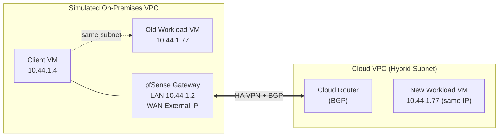

[繁體中文](README.md) | **English**

# GCP VPC Hybrid Subnets Lab (Simulating On-Premises ↔ Cloud Migration with pfSense)

A complete record of building and validating the GCP [VPC Hybrid Subnets](https://cloud.google.com/vpc/docs/hybrid-subnets) feature: the same internal IP address, after a workload is moved from "on-premises" to the cloud, can be reached by clients without any reconfiguration whatsoever.

> Don't have a pfSense environment yet? Refer to the [`pfsense-on-gcp`](https://github.com/terensy/pfsense-on-gcp) repo to deploy the on-premises gateway first, then come back here for the Hybrid Subnets testing.

## What Problem This Feature Solves

One of the most common pain points in enterprise cloud migration: once a machine moves to the cloud, its IP address usually changes, meaning every client, DNS entry, and firewall rule that hasn't been updated needs to be changed too — severely constraining the migration window.

Hybrid Subnets allow a cloud VPC subnet to **share the same CIDR** as an on-premises network. During migration, old and new machines can have exactly the same IP address — a host route (`/32`) is used to switch one machine at a time, determining which instance responds to that address. This enables a genuinely zero-downtime migration.

## Environment Architecture



- **Simulated on-premises**: a separate VPC containing pfSense (acting as the on-premises gateway/router), a client VM, and an "old" workload VM
- **Cloud**: another separate VPC (in a separate project) with a subnet that has `allowSubnetCidrRoutesOverlap` enabled (the core Hybrid Subnet switch) and a "new" workload VM using **exactly the same internal IP as the on-premises VM**
- The two sides are connected via **HA VPN + Cloud Router dynamic BGP**

## Prerequisites

- Two GCP projects (one for cloud, one to simulate on-premises) — or two separate VPCs within the same project
- pfSense already deployed on the on-premises side (see [`pfsense-on-gcp`](https://github.com/terensy/pfsense-on-gcp)), with the LAN interface subnet CIDR **exactly matching** the cloud subnet CIDR that will take over
- HA VPN + BGP connectivity infrastructure between the cloud and pfSense — if not yet built, see the next section

## Building the Connectivity Infrastructure from Scratch

This section covers connecting "an already-deployed pfSense" to "a cloud VPC" to run BGP dynamic routing for a hybrid subnet. Completing this section brings you to the "Established" state assumed by the prerequisites above.

### Architecture Decisions

- **pfSense terminates the new HA VPN directly on the WAN interface, not via LAN**: the LAN interface has no external IP, so the cloud VPN Gateway cannot reach it over the public internet. Also, it is best to keep the VPN termination point separate from the subnet used for Proxy ARP, to avoid hairpin routing/ARP conflicts.
- **Build a separate, dedicated HA VPN Gateway + Cloud Router** rather than sharing any existing VPN/Router already in the project, to avoid mixing routes and complicating troubleshooting.
- Use **route-based VPN (IKEv2 + VTI) + BGP dynamic routing** rather than static routes — dynamic `/32` advertisement is essential when migrating VMs one at a time.
- ASN planning: use one ASN for the cloud-side Cloud Router (e.g. `65001`) and another for the pfSense side (e.g. `65002`). If there are other BGP sessions in the same project, ensure ASNs do not conflict.
- Set the Cloud Router BGP peer to `CUSTOM` advertisement mode initially, **with no routes advertised** — add `/32` entries only when a VM is actually being migrated. This is the officially recommended incremental approach, avoiding the risk of advertising an entire CIDR that conflicts with existing on-premises hosts.

### Create the Hybrid Subnet (Cloud Project)

```bash
gcloud beta compute networks subnets create <HYBRID_SUBNET_NAME> \
  --project=<CLOUD_PROJECT_ID> \
  --network=<CLOUD_VPC_NAME> \
  --region=<REGION> \
  --range=<SHARED_CIDR>/24 \
  --allow-cidr-routes-overlap
```

`<SHARED_CIDR>` must exactly match the CIDR of the pfSense LAN interface subnet on the on-premises side.

### Create a Dedicated HA VPN + Cloud Router (Cloud Project)

```bash
# HA VPN Gateway
gcloud compute vpn-gateways create hybrid-vpn-gateway-dev \
  --project=<CLOUD_PROJECT_ID> --region=<REGION> \
  --network=<CLOUD_VPC_NAME>
# You will receive two public IPs (interface0 / interface1)

# External VPN Gateway representing pfSense (single public IP)
gcloud compute external-vpn-gateways create pfsense-peer-gw \
  --project=<CLOUD_PROJECT_ID> \
  --interfaces=0=<PFSENSE_WAN_EXTERNAL_IP>

# Cloud Router
gcloud compute routers create hybrid-router-dev \
  --project=<CLOUD_PROJECT_ID> --region=<REGION> \
  --network=<CLOUD_VPC_NAME> --asn=65001

# Two tunnels (HA VPN requires at least two)
gcloud compute vpn-tunnels create hybrid-dev-2-pfsense-1 \
  --project=<CLOUD_PROJECT_ID> --region=<REGION> \
  --vpn-gateway=hybrid-vpn-gateway-dev --interface=0 \
  --peer-external-gateway=pfsense-peer-gw --peer-external-gateway-interface=0 \
  --ike-version=2 --shared-secret='<TUNNEL1_PSK>' \
  --router=hybrid-router-dev

gcloud compute vpn-tunnels create hybrid-dev-2-pfsense-2 \
  --project=<CLOUD_PROJECT_ID> --region=<REGION> \
  --vpn-gateway=hybrid-vpn-gateway-dev --interface=1 \
  --peer-external-gateway=pfsense-peer-gw --peer-external-gateway-interface=0 \
  --ike-version=2 --shared-secret='<TUNNEL2_PSK>' \
  --router=hybrid-router-dev

# Router interface + BGP peer (repeat for each tunnel, changing interface-name)
gcloud compute routers add-interface hybrid-router-dev \
  --project=<CLOUD_PROJECT_ID> --region=<REGION> \
  --interface-name=if-hybrid-session-1 --vpn-tunnel=hybrid-dev-2-pfsense-1

gcloud compute routers add-bgp-peer hybrid-router-dev \
  --project=<CLOUD_PROJECT_ID> --region=<REGION> \
  --peer-name=pfsense-bgp-session-1 --interface=if-hybrid-session-1 \
  --peer-asn=65002 --advertisement-mode=CUSTOM
```

> Generate pre-shared keys using a password generator. Do not include them in any file that will be committed to version control.

### pfSense Side: IPsec Phase 1/2

Under `VPN > IPsec > Tunnels`, create two Phase 1 entries, both using **Route-based (Phase 2 set to Routed / VTI)**:

- Key Exchange: IKEv2
- Interface: WAN
- Auth: Mutual PSK
- My/Peer identifier: My IP address / Peer IP address
- Encryption: AES 256 / SHA256 / DH Group 14
- Phase 2 Local/Remote Tunnel Address: the link-local `/30` addresses corresponding to the BGP sessions on the cloud side

### pfSense Side: FRR (BGP Daemon)

Under `Services > FRR`:

- **Global/Zebra**: Enable; set Router ID to the pfSense LAN IP
- **BGP**: Enable; set Local AS to `65002`; leave Networks to Distribute empty for now
- **Neighbors** (one per tunnel): set Peer IP to the link-local IP on the cloud side, Remote AS to `65001`, Update Source to Default — the VTI interface is a point-to-point `/30` and FRR will automatically find the correct interface using connected routes; there is no need to assign the tunnel interface as a pfSense interface explicitly.

### Verify the Connection is Established

```bash
gcloud compute vpn-tunnels list --project=<CLOUD_PROJECT_ID>
# Both tunnels must show "Tunnel is up and running."

gcloud compute routers get-status hybrid-router-dev \
  --project=<CLOUD_PROJECT_ID> --region=<REGION>
# Both BGP peers must show state: Established / status: UP
```

On the pfSense side, go to `Services > FRR > BGP > Status` — both neighbours should show `BGP state = Established`. Having `0 accepted prefixes` at this stage is normal — neither side has added any custom advertisements yet.

## Testing SOP

The full process is divided into four stages: baseline measurement → simulated cutover → cutover validation → full rollback. Each stage uses a simple test web page (with different response content) to clearly determine which machine is currently responding — more reliable than reading ping TTL values alone.

### Preparation: Set Up a Test Web Page on Each Workload VM

```bash
# On-premises VM
ssh <onprem-workload> 'mkdir -p ~/www-test && echo "This is onprem vm" > ~/www-test/index.html && \
  (nohup python3 -m http.server 8080 --directory ~/www-test > /tmp/httpserver.log 2>&1 < /dev/null &)'

# Cloud VM
ssh <cloud-dr-workload> 'mkdir -p ~/www-test && echo "This is cloud DR vm" > ~/www-test/index.html && \
  (nohup python3 -m http.server 8080 --directory ~/www-test > /tmp/httpserver.log 2>&1 < /dev/null &)'
```

> ⚠️ **Pitfall**: this `nohup` process only survives for the current boot session. Any `gcloud compute instances stop` followed by a restart will require re-running this command — it does not restart automatically.

### Stage 1 — Baseline

From the on-premises client, hit the target IP to confirm the "old" machine is currently responding:

```bash
ssh <onprem-client> "curl -s -m 6 <TARGET_IP>:8080; echo; ping -c 3 <TARGET_IP>"
```

**Expected**: web response is `This is onprem vm`, `ttl=64`, RTT < 1ms (same-subnet direct connection).

### Stage 2 — Simulated Cutover

Three sub-steps — order is important:

**2.1 Stop the old on-premises VM** (simulating that it has already been migrated away)

```bash
gcloud compute instances stop <onprem-workload> --project=<ONPREM_PROJECT_ID> --zone=<ZONE>
```

**2.2 Add a host route advertisement on the cloud Cloud Router** (on both BGP peer sessions, preserving any existing advertisements)

```bash
gcloud compute routers update-bgp-peer <CLOUD_ROUTER> \
  --project=<CLOUD_PROJECT_ID> --region=<REGION> \
  --peer-name=<BGP_PEER_1> \
  --advertisement-mode=CUSTOM \
  --set-advertisement-ranges=<any-existing-/32s,><TARGET_IP>/32

# Repeat for the second BGP session
```

**2.3 Enable Proxy ARP on pfSense** so that requests for this IP from the on-premises network are intercepted by pfSense (use the pfSense shell / serial console — see "Common Pitfalls" below for details):

In the pfSense WebGUI: Firewall → Virtual IPs → Add, Type `Proxy ARP`, Interface `LAN`, enter `<TARGET_IP>/32`. You can also call `interface_proxyarp_configure()` directly from a shell to achieve the same effect.

### Stage 3 — Cutover Validation

Run exactly the same command as Stage 1 — this time the cloud machine should respond:

```bash
ssh <onprem-client> "curl -s -m 6 <TARGET_IP>:8080; echo; ping -c 3 <TARGET_IP>"
```

**Expected**: web response changes to `This is cloud DR vm`, `ttl` decreases (two additional L3 hops via pfSense and the cloud router), RTT increases slightly (traversing an encrypted VPN tunnel). **Same IP address — the client has changed nothing.**

### Stage 4 — Full Rollback

Reverse the order of Stage 2:

```bash
# 4.1 Remove the cloud BGP advertisement, reverting to the original set (without <TARGET_IP>/32)
gcloud compute routers update-bgp-peer <CLOUD_ROUTER> \
  --project=<CLOUD_PROJECT_ID> --region=<REGION> \
  --peer-name=<BGP_PEER_1> \
  --advertisement-mode=CUSTOM \
  --set-advertisement-ranges=<any-existing-/32s>

# 4.2 Restart the on-premises VM
gcloud compute instances start <onprem-workload> --project=<ONPREM_PROJECT_ID> --zone=<ZONE>

# 4.3 Remove the Proxy ARP VIP from pfSense (WebGUI or shell)

# 4.4 After the VM reboots, manually restart the test web page (see pitfall note above)
sleep 20
ssh <onprem-workload> '(nohup python3 -m http.server 8080 --directory ~/www-test > /tmp/httpserver.log 2>&1 < /dev/null &)'
```

Run the Stage 1 command one final time to confirm the baseline state has been restored.

## Test Results

| Stage | Web Response | Ping TTL | RTT |
|---|---|---|---|
| Before cutover | `This is onprem vm` | 64 | < 1ms |
| After cutover | `This is cloud DR vm` | 62 | 1–3ms |
| After rollback | `This is onprem vm` | 64 | < 1ms |


## Key Principle: Proxy ARP and "Where to Send" Are Two Separate Things

The most commonly confused point during testing: **Proxy ARP itself carries no routing information** — it only causes pfSense to "claim" this IP so that packets are not intercepted by other on-premises machines. What actually determines where packets are sent is pfSense's own routing table — specifically, the `/32` host route learned from the Cloud Router via BGP.

The complete causal chain:

```
Proxy ARP (lets packets reach pfSense)
    → pfSense consults its routing table
    → finds the /32 route learned via BGP (next hop points to VPN tunnel)
    → packet enters IPsec tunnel and arrives in the cloud
```

Both are required. Testing confirmed: BGP route only (no Proxy ARP) means the client cannot even resolve ARP/neighbour — completely unreachable; Proxy ARP only (no BGP route advertisement) means pfSense accepts the packet but has no route for it and routes it back to the local on-premises network.

One additional important finding: **GCP VPC networks have no genuine Ethernet broadcast ARP** — same-subnet packet delivery is entirely determined by GCP's own routing table, and no ARP packets appear on pfSense's physical interface at all. Proxy ARP works here via a mechanism at the GCP network layer whose details have not been fully confirmed — not via the conventional "respond to ARP broadcasts" mechanism.

## Common Pitfalls

### Testing Stage

- **pfSense's default shell is tcsh, not bash**: if you want to paste multi-line, `$variable`-containing heredocs via shell / serial console to change settings, tcsh handles quoting and variable expansion differently from bash and the paste is likely to break. Type `sh` first to switch to Bourne shell before pasting commands.
- **Once a VM has been `stop`ped, all non-persistent services inside it disappear**: the `nohup` process for the test web page and any other manually started background services must be restarted manually after reboot.
- **Two separate firewall layers must be checked independently**: GCP VPC firewall rules and pfSense's own firewall rules are completely independent. Both must allow the traffic. "Ping works but a specific port doesn't" usually means one layer has only partially opened the relevant protocol/port.

### Connectivity Infrastructure Build Stage

- **The on-premises LAN subnet also needs `allow-cidr-routes-overlap`**, not just the cloud hybrid subnet. The reason is that a static route more specific than the subnet's own `/24` needs to be created inside the on-premises VPC (see next point). Without this flag, the route creation fails with `hides the address space of the network`:

  ```bash
  gcloud beta compute networks subnets update <ONPREM_LAN_SUBNET> \
    --project=<ONPREM_PROJECT_ID> --region=<REGION> \
    --allow-cidr-routes-overlap
  ```

- **The on-premises VPC also needs a static route directing traffic destined for the migrating VM to pfSense** — this is the critical route that "doesn't need to be set up separately" in the testing SOP because it already exists:

  ```bash
  gcloud compute routes create route-to-dr-vm \
    --project=<ONPREM_PROJECT_ID> --network=<ONPREM_LAN_VPC> \
    --destination-range=<TARGET_IP>/32 \
    --next-hop-instance=<PFSENSE_INSTANCE_NAME> \
    --next-hop-instance-zone=<ZONE> --priority=100
  ```

  Using `--next-hop-instance` requires the instance to have `--can-ip-forward` enabled.

- **BGP advertisement directions are intentionally asymmetric**: the cloud Cloud Router advertises only the `/32` of already-migrated VMs; pfSense (FRR) in the opposite direction advertises the **entire shared CIDR** (`Services > FRR > BGP > Networks to Distribute`, enter `/24`) — not a precise `/32`. The reason is that the cloud hybrid subnet has a "fall back to on-premises if no local resource is found" mechanism, which requires this coarse-grained on-premises route to have something to fall back to. Without it, any address the cloud doesn't recognise has nowhere to go.

- **FRR's `network` advertisement statement requires an "active" exact-match route in the kernel routing table**: pfSense's interface on GCP uses `/32` point-to-point addressing, and the `<CIDR> via <interface gateway>` route auto-generated by the system defaults to inactive state — FRR cannot find anything to advertise. The fix is to manually create a Gateway on that interface (IP set to the implicit gateway for the subnet, e.g. `x.x.x.1`, and **tick Far Gateway** — because GCP uses `/32` addressing, the Gateway IP is inherently outside the interface's own subnet range and form validation would otherwise reject it), then add a corresponding Static Route to make it active. This route is never actually used to forward packets (more specific routes always take priority) — it exists purely to give FRR something to match against for advertisement.

  > Minor pitfall: in the Static Route form, the Destination network field takes only the network address (e.g. `10.44.1.0`) — the mask must be selected using the separate dropdown alongside it. Do not type `/24` in the text field; it will conflict with the dropdown's default value and cause an error.

- **Cloud Router does not by default accept BGP-learned routes that overlap with its own VPC subnets**: even if the BGP session shows as Established and pfSense is genuinely advertising the `network` statement, `numLearnedRoutes` on the cloud side will still be 0. You must explicitly whitelist the overlapping CIDR:

  ```bash
  gcloud compute routers update-bgp-peer hybrid-router-dev \
    --project=<CLOUD_PROJECT_ID> --region=<REGION> \
    --peer-name=pfsense-bgp-session-1 \
    --set-custom-learned-route-ranges=<SHARED_CIDR>/24
  # Repeat for the other BGP session
  ```

- **FRR has `ebgp-requires-policy` (RFC 8212) enabled by default**: any eBGP neighbour without an explicit policy (route-map/prefix-list) exchanges absolutely no routes — even if the session shows Established (check `Inbound/Outbound updates discarded due to missing policy` in neighbour detail). For a lab environment you can simply disable it: `Services > FRR > BGP > Advanced > eBGP`, tick **Disable eBGP Require Policy**. After saving, you must **force-reset the BGP session** for this to take effect (simply saving/reloading the config is insufficient):

  ```bash
  /usr/local/bin/vtysh -c "clear bgp *"
  ```

  (`vtysh` is not in the default PATH — use the full path.)

- **Custom-mode VPCs do not auto-generate internal allow firewall rules** — both VPCs need rules added manually:

  ```bash
  # Cloud side: allow on-premises LAN to reach the cloud hybrid subnet
  gcloud compute firewall-rules create allow-onprem-lan-in \
    --project=<CLOUD_PROJECT_ID> --network=<CLOUD_VPC_NAME> \
    --direction=INGRESS --action=ALLOW --rules=icmp,tcp:22 \
    --source-ranges=<SHARED_CIDR>/24

  # On-premises side: internal LAN traffic (client ↔ pfSense etc.) has no allow rules by default
  gcloud compute firewall-rules create allow-trust-vpc-internal \
    --project=<ONPREM_PROJECT_ID> --network=<ONPREM_LAN_VPC> \
    --direction=INGRESS --action=ALLOW --rules=icmp,tcp,udp \
    --source-ranges=<SHARED_CIDR>/24
  ```

- **pfSense's LAN firewall rules are empty by default (if the VM was built via script/API without going through the install wizard), and the built-in "LAN subnets" alias has a `/32` trap**: pfSense's LAN interface on GCP also uses `/32` point-to-point addressing. If the interface was not changed to Static, **the built-in "LAN subnets" alias expands to only pfSense's own `/32`** — not the entire `/24`. Any allow rule using this alias as its Source will never match traffic from other LAN hosts, which will all be silently dropped by the default deny at the bottom (rule Stats will always show `0/0 B`, making it hard to spot the alias as the root cause at first glance). Fix: in the rule Source, do not use the "LAN subnets" alias — instead select type **Network** and manually enter the full `<SHARED_CIDR>/24`.

## Why Proxy ARP Is Not "Sufficient on Its Own" Here

Proxy ARP is designed for genuine on-premises "physical L2 broadcast domains" where hosts on the same subnet actually send ARP broadcasts that a router intercepts and replies to. GCP VPC networks are not genuine L2 broadcast domains — each VM uses `/32` point-to-point addressing and the SDN control plane handles all resolution directly. No real ARP broadcasts reach pfSense's physical interface. For this reason, traffic from other VMs on the on-premises subnet is not automatically intercepted by pfSense's Proxy ARP. To actually route packets to pfSense and forward them into the tunnel, the **VPC static route** described in the "Building the Connectivity Infrastructure" section is the true determinant of packet flow. Proxy ARP is still recommended to be enabled (so behaviour is consistent with being connected to a real on-premises network), but in this GCE simulation environment it is not the only — or even the primary — deciding factor.

## Further Reading

- [GCP Official Documentation: Hybrid Subnets](https://cloud.google.com/vpc/docs/hybrid-subnets)
- [`pfsense-on-gcp`](https://github.com/terensy/pfsense-on-gcp) — how pfSense itself is deployed in this environment

## Licence

MIT
