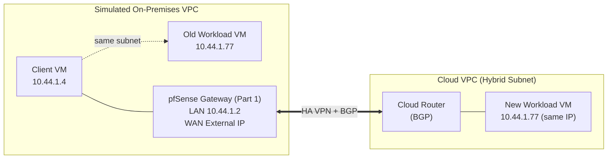

[繁體中文](README.md) | **English**

# GCP VPC Hybrid Subnets Lab: Zero-Downtime Migration with a pfSense-Simulated On-Premises Network

A complete, hands-on build-and-test record for Google Cloud's [VPC Hybrid Subnets](https://cloud.google.com/vpc/docs/hybrid-subnets) feature: after a workload moves from "on-premises" to the cloud, it keeps the exact same internal IP address, and clients need zero reconfiguration to reach it.

This repository originally shipped as two separate projects — a pfSense-on-GCP deployment guide and a Hybrid Subnets test lab — because they were written as sequential steps against the same environment. They are merged here into one document, in build order, so you can go from an empty GCP project to a validated zero-downtime cutover without switching repos.

> **Read this in order**: [Part 1](#part-1--deploy-pfsense-on-gcp-the-on-premises-gateway-simulator) builds the pfSense VM that simulates your on-premises gateway. [Part 2](#part-2--gcp-vpc-hybrid-subnets-migration-test) uses that pfSense VM to run the actual Hybrid Subnets cutover test. If you already have a pfSense gateway running on GCP with a routable LAN interface, skip straight to Part 2.

## Contents

- [Part 1 — Deploy pfSense on GCP](#part-1--deploy-pfsense-on-gcp-the-on-premises-gateway-simulator)
  - [Why run pfSense on GCP](#why-run-pfsense-on-gcp)
  - [Deployment process](#deployment-process)
  - [Security notice](#️-security-notice)
  - [Validation cross-reference](#validation-cross-reference)
- [Part 2 — GCP VPC Hybrid Subnets Migration Test](#part-2--gcp-vpc-hybrid-subnets-migration-test)
  - [What problem this feature solves](#what-problem-this-feature-solves)
  - [Environment architecture](#environment-architecture)
  - [Prerequisites](#prerequisites)
  - [Building the connectivity infrastructure from scratch](#building-the-connectivity-infrastructure-from-scratch)
  - [Testing SOP](#testing-sop)
  - [Test results](#test-results)
  - [Key principle: Proxy ARP and "where to send" are two separate things](#key-principle-proxy-arp-and-where-to-send-are-two-separate-things)
  - [Common pitfalls](#common-pitfalls)
  - [Why Proxy ARP is not "sufficient on its own" here](#why-proxy-arp-is-not-sufficient-on-its-own-here)
- [Further reading](#further-reading)
- [Licence](#licence)

---

## Part 1 — Deploy pfSense on GCP (the on-premises gateway simulator)

A deployment guide for pfSense on GCP, validated against a real environment running dual VPCs (trust/untrust), HA VPN, and BGP. Based on the two reference sources below, cross-verified and supplemented with hands-on testing.

**References**

- [Deploying pfSense in Google Cloud](https://blog.matrixpost.net/deploying-pfsense-in-google-cloud-a-step-by-step-guide-to-your-own-cloud-firewall/) — primary reference for the end-to-end deployment process
- [Netgate Official Mirror](https://atxfiles.netgate.com/mirror/downloads/) — pfSense CE ISO / IMG downloads for all releases

### Why run pfSense on GCP

GCE VMs have no built-in software firewall or router product. If you need to:

- Centrally manage traffic in and out of cloud VPCs
- Simulate an on-premises network environment (for migration testing, hybrid cloud architectures such as Hybrid Subnets — see [Part 2](#part-2--gcp-vpc-hybrid-subnets-migration-test))
- Use pfSense-specific features (Proxy ARP, easyrule, the FRR dynamic routing package)

…you will need to build a pfSense image yourself and deploy it as a standard Compute Engine VM. There is no ready-made pfSense CE image on the GCP Marketplace, so the entire process is manual.

### Deployment process

The overall approach is a two-stage flow: first produce a disk with pfSense installed and snapshot it, then boot all production instances from that snapshot. The installation medium is never used as the boot image directly.

#### 1. Download the installer image — you must use `memstick-serial`

Download the **`memstick-serial`** variant of pfSense CE from the [Netgate official mirror](https://atxfiles.netgate.com/mirror/downloads/) (2.7.2 was the latest at time of writing):

```
wget https://atxfiles.netgate.com/mirror/downloads/pfSense-CE-memstick-serial-2.7.2-RELEASE-amd64.img.gz
gunzip pfSense-CE-memstick-serial-2.7.2-RELEASE-amd64.img.gz
mv pfSense-CE-memstick-serial-2.7.2-RELEASE-amd64.img disk.raw
```

**Why the `-serial` variant is mandatory — you cannot use a standard `memstick` or ISO**: GCE VMs have no VGA or graphical console. The only console available is the serial port (`gcloud compute connect-to-serial-port`, corresponding to `ttyS0` inside the VM). A standard memstick image directs the installer output to VGA; on GCE this produces a completely blank screen with no way to interact. Only the `memstick-serial` variant redirects the installer output to the serial port, making it visible and operable via the GCP serial console. This is the single most common mistake in the entire process — choosing the wrong variant leaves you stuck at the very first step.

> ⚠️ **2026 currency note**: Netgate has since changed how pfSense CE is officially distributed. `docs.netgate.com` now lists 2.7.2 as **Older/Unsupported**, with 2.8.1 as the current stable and 2.9.0 also listed under current/upcoming releases. The [official download page](https://www.pfsense.org/download/) now routes through the free **Netgate Installer** — a small boot image (still offered in `memstick-serial` format) that requires a free Netgate Store account and fetches the actual pfSense build over the network *during* installation, rather than shipping as one self-contained `.img.gz` you can `wget` directly. The legacy mirror this guide uses (`atxfiles.netgate.com`) is still live at the time of writing but only serves images up to the EOL 2.7.2 release. The steps below remain exactly what was built, validated, and is still running in the author's own environment (HA VPN + BGP, for an extended period) — they are kept as the documented baseline. If you switch to the newer Netgate Installer flow, the GCP-specific mechanics (two-NIC temp VM, install to the second disk, snapshot, build a production image from the snapshot) should still apply, but that exact flow has not been hands-on validated in GCP by this guide.

GCP custom images require the filename `disk.raw` packaged as a `.tar.gz`:

```
tar --format=oldgnu -Sczf pfsense-installer-2.7.2-amd64.tar.gz disk.raw
```

Upload to a GCS bucket and create the **installer image** (note: booting this image launches the installer wizard, not a ready-to-use system — it will only be used to build the temporary install VM in the next step):

```
gsutil cp pfsense-installer-2.7.2-amd64.tar.gz gs://<YOUR_BUCKET>/

gcloud compute images create pfsense-installer-2-7-2 \
  --source-uri=gs://<YOUR_BUCKET>/pfsense-installer-2.7.2-amd64.tar.gz \
  --project=<YOUR_PROJECT_ID>
```

#### 2. Plan the network: one VPC each for WAN and LAN

pfSense requires at least two NICs: one for the untrusted side (WAN, facing the internet or upstream), and one for the trusted side (LAN, internal network). In GCP, the approach is **two separate VPCs each with its own subnet**, with the VM created with two NICs attached:

```
gcloud compute networks create untrust-vpc --subnet-mode=custom
gcloud compute networks subnets create wan-subnet \
  --network=untrust-vpc --region=<REGION> --range=10.11.2.0/24

gcloud compute networks create trust-vpc --subnet-mode=custom
gcloud compute networks subnets create lan-subnet \
  --network=trust-vpc --region=<REGION> --range=10.44.1.0/24
```

#### 3. Create the temporary install VM (two disks) and run the installer

This VM is disposable — its sole purpose is to install pfSense onto the second disk:

- **Disk 1 (boot disk)**: the `pfsense-installer-2-7-2` image created in the previous step — this is the installer wizard, used for booting
- **Disk 2 (install target)**: a brand-new blank disk (20 GB recommended) — the installer wizard will write pfSense onto **this disk**

```
gcloud compute instances create pfsense-installer-temp \
  --project=<YOUR_PROJECT_ID> \
  --zone=<ZONE> \
  --machine-type=e2-medium \
  --image=pfsense-installer-2-7-2 \
  --create-disk=name=pfsense-target-disk,size=20GB,auto-delete=no \
  --network-interface=subnet=lan-subnet,no-address \
  --network-interface=subnet=wan-subnet \
  --metadata=serial-port-enable=true
```

`auto-delete=no` is critical — this disk will be snapshotted after installation and must not be deleted when the VM is removed.

Connect via serial console to run the installer:

```
gcloud compute connect-to-serial-port pfsense-installer-temp \
  --project=<YOUR_PROJECT_ID> --zone=<ZONE>
```

Follow the prompts: accept the licence agreement → select *Install pfSense* → choose a filesystem (ZFS or UFS, either works) → **select the second disk as the install target (Disk 2, not the boot disk)** → confirm installation → when complete, select *Shell* → run `poweroff` to shut down.

#### 4. Create a reusable production image from the installed disk

Once the VM is shut down, take a snapshot of **Disk 2** (`pfsense-target-disk`, the one with pfSense installed) and create a production image from it:

```
gcloud compute disks snapshot pfsense-target-disk \
  --project=<YOUR_PROJECT_ID> --zone=<ZONE> \
  --snapshot-names=pfsense-2-7-2-installed-snapshot

gcloud compute images create pfsense-2-7-2-amd64 \
  --project=<YOUR_PROJECT_ID> \
  --source-snapshot=pfsense-2-7-2-installed-snapshot
```

Every production pfSense instance henceforth should boot from **this snapshot-derived `pfsense-2-7-2-amd64` image**, not the `pfsense-installer-2-7-2` image from Step 1. Once this is done, the temporary install VM (`pfsense-installer-temp`) and its disks can be deleted.

#### 5. Create the production pfSense VM

```
gcloud compute instances create pfsense-gateway \
  --project=<YOUR_PROJECT_ID> \
  --zone=<ZONE> \
  --machine-type=e2-medium \
  --image=pfsense-2-7-2-amd64 \
  --can-ip-forward \
  --network-interface=subnet=lan-subnet,no-address \
  --network-interface=subnet=wan-subnet \
  --tags=pfsense \
  --metadata=serial-port-enable=true
```

Key flags — all required for pfSense to function correctly as a gateway:

| Flag | Why it is needed |
|---|---|
| `--can-ip-forward` | GCP drops packets whose source or destination does not match the VM's own IP by default. This flag is **applied at the VM level, not per NIC**, and takes effect on both NICs. Without it, pfSense cannot forward any traffic whatsoever. |
| First `--network-interface` (LAN, `no-address`) | GCP treats the **first NIC** as the primary interface. LAN typically does not need an external IP; using `no-address` saves a public IP address. |
| Second `--network-interface` (WAN, with external IP) | The egress path for outbound traffic; a NAT IP is assigned by default. |
| `--metadata=serial-port-enable=true` | Without this, `gcloud compute connect-to-serial-port` is unavailable for initial configuration or emergency maintenance — effectively losing the only out-of-band management channel. |

A typical running environment looks like this (two projects representing cloud and simulated on-premises respectively — substitute your own names):

```
NAME                          NIC0 (LAN)     NIC1 (WAN)              External IP
instance-pfsense-wan-gateway  10.44.1.2      10.11.2.5               <WAN_EXTERNAL_IP>
```

#### 6. Initial configuration

After the first boot, connect via serial console (same command as Step 3, substituting the production VM name). Be aware of three GCP-specific pitfalls:

**(a) MTU** — The default MTU for GCP VPCs is 1460 (not the conventional 1500). Both the WAN and LAN interfaces must be adjusted; otherwise certain connections will exhibit strange packet fragmentation issues:

```
ifconfig vtnet0 mtu 1460
ifconfig vtnet1 mtu 1460
```

**(b) Use DHCP for interfaces, do not assign IPs manually** — GCP uses its own DHCP server to deliver the addresses configured in each subnet to the VM. Setting the LAN interface to DHCP is sufficient (in our actual environment, `config.xml` has `<ipaddr>dhcp</ipaddr>` for the LAN interface).

**(c) WAN interface has no default gateway** — In GCP, only the **first NIC (nic0)** receives a default gateway via DHCP. The pfSense WAN interface is typically on the second NIC (untrust VPC, nic1); DHCP assigns an IP but no gateway, leaving pfSense with no internet connectivity (`ping 8.8.8.8` drops 100% of packets). The fix:

1. Set the WAN interface to **Static IPv4**, entering the address GCP assigned to that NIC with a `/32` mask (GCP uses point-to-point addressing for each NIC)
2. Go to `System > Routing > Gateways` and manually add a gateway, entering the implicit gateway IP for that subnet (typically `.1` of the CIDR — e.g. `10.11.2.1` for `10.11.2.0/24`), and **ensure you tick Far Gateway** — because GCP uses `/32` addressing, this gateway IP is inherently outside the interface's own subnet range, which pfSense's default form validation would reject; Far Gateway bypasses that check
3. Assign this gateway as the WAN interface's upstream gateway — do not rely on any gateway information from DHCP

#### 7. Internet connectivity: DNS and package manager troubleshooting

After completing the basic network configuration, two common sticking points can make pfSense appear to be working correctly whilst being unusable in practice:

**DNS resolution hanging** — The DNS Resolver (Unbound) uses full recursive resolution by default (communicating directly with root DNS servers), which can hang without response in some cloud network environments. Fix: go to `Services > DNS Resolver` and enable **Enable DNS Query Forwarding**, switching to the upstream DNS servers configured in `System > General Setup` (e.g. `8.8.8.8` / `8.8.4.4`). If the logs show it hanging on `_ta` keytag queries related to the root trust anchor, this typically indicates that large DNSSEC-related UDP packets are being dropped in the cloud environment — try disabling **DNSSEC** to rule this out.

**Package Manager unable to fetch package lists** — If the GUI repeatedly fails to retrieve packages and the official repository appears to be down, do not immediately assume the domain itself is the problem: pfSense's repository configuration uses **SRV record** lookups (for hostnames such as `pkg01-atx.netgate.com` / `pkg00-atx.netgate.com`), not standard A records. Failing to find an A record via `dig`/`nslookup` is entirely normal — SRV records are what you need to query. The most reliable way to test actual connectivity is to run the following from a shell:

```
pkg-static update
```

If this command successfully fetches the repository, any errors shown in the GUI are typically stale cache from a previous failure. Refreshing the Available Packages page should restore normal behaviour.

#### 8. WebGUI access and Referer check

The pfSense WebConfigurator has built-in CSRF and Referer protection. If you access it via a hostname or IP that differs from what was originally configured (for instance, forwarded to `localhost` via an IAP tunnel, or accessed directly via the WAN external IP), you will see:

```
An HTTP_REFERER was detected other than what is defined in System > Advanced
```

The quickest fix is to run the built-in playback script from a shell:

```
pfSsh.php playback disablereferercheck
```

(In our own validation environment we manually edited the `<system><webgui><althostnames>` section of `config.xml` to add an allowlist entry — the effect is identical. However, the `pfSsh.php playback` built-in command is more straightforward, and is the recommended approach going forward.)

#### 9. Firewall rules: default deny, add rules explicitly

pfSense blocks all traffic by default after booting, including WebGUI access from the WAN. At a minimum, the following rules need to be added manually:

- LAN interface: a default "LAN net → any" allow rule is usually already present
- If you need to manage the WebGUI directly from the WAN (**not recommended — see security notice below**), add a `pass` rule: use System → Advanced, or use the `easyrule` shell utility to add one quickly:

```
easyrule pass wan tcp <your-source-IP> '(self)' 443
```

### ⚠️ Security notice

This is the step most likely to be overlooked and most likely to cause problems:

1. **Change the default password immediately** — The pfSense WebGUI ships with the default credentials `admin` / `pfsense`. The very first thing to do after installation is to go to System → User Manager and change the password. Do not put this off.
2. **Do not expose the WebGUI directly on the WAN external IP**. Even with the password changed, a publicly reachable management interface is an attack surface in its own right. The correct approach is to access pfSense's LAN-side management interface via a GCP IAP tunnel (`gcloud compute start-iap-tunnel`) or through a dedicated bastion host — port 443/80 should not be open on the WAN at all.
3. If you temporarily open the management interface on the WAN for testing purposes, remove the corresponding firewall rule immediately once testing is complete.

### Validation cross-reference

The following table cross-references the recommendations from the reference article against our actual deployed environment (which has been running with HA VPN and BGP dynamic routing for some time):

| Item | Reference article | Validated in our environment |
|---|---|---|
| Installer image variant | Must use `memstick-serial` (GCE only has a serial console; standard memstick produces a blank boot screen) | ✅ The most common pitfall — choosing the wrong variant leaves the installer hanging on a blank screen |
| Installation process | Two-disk temporary install VM → install to second disk → snapshot → build production image from snapshot | ✅ Confirmed — production VMs boot from the snapshot-derived image, **not** directly from the install medium |
| Image format | `disk.raw` packaged as `tar.gz`, uploaded to GCS, used to create a custom image | ✅ Confirmed — our running image names reflect this process |
| `--can-ip-forward` | Enabled at VM level, not per NIC | ✅ Confirmed — `canIpForward: true` |
| Dual VPC / dual NIC | One VPC each for trust/untrust | ✅ Confirmed — LAN interface has no external IP; WAN interface does |
| DHCP for interfaces | Do not assign IPs manually | ✅ Confirmed |
| Serial console | Used for installation and troubleshooting | ✅ Confirmed — and it is the only rescue channel when the WebGUI is unreachable |
| Referer check | `pfSsh.php playback disablereferercheck` | Functionally equivalent to manually editing `althostnames` — either works |
| WAN default gateway | Not specifically mentioned in the article | ⚠️ Additional finding: when WAN is on the second NIC, GCP DHCP does not supply a gateway — a Static Gateway must be configured manually with Far Gateway ticked, or the VM will have no internet connectivity after installation |
| DNS / package manager | Not specifically mentioned in the article | ⚠️ Additional finding: DNS Resolver recursive resolution can hang in some cloud network environments — Query Forwarding is required; the package repository uses SRV record lookups; failing to find A records is normal |
| WebGUI exposure warning | Article explicitly warns against public exposure | ✅ Highly relevant — in our own test environment we once left a test WAN rule in place and received an alert that the `admin` account still had the default password |

---

## Part 2 — GCP VPC Hybrid Subnets Migration Test

A complete record of building and validating the GCP [VPC Hybrid Subnets](https://cloud.google.com/vpc/docs/hybrid-subnets) feature on top of the pfSense gateway from Part 1: the same internal IP address, after a workload is moved from "on-premises" to the cloud, can be reached by clients without any reconfiguration whatsoever.

### What problem this feature solves

One of the most common pain points in enterprise cloud migration: once a machine moves to the cloud, its IP address usually changes, meaning every client, DNS entry, and firewall rule that hasn't been updated needs to be changed too — severely constraining the migration window.

Hybrid Subnets allow a cloud VPC subnet to **share the same CIDR** as an on-premises network. During migration, old and new machines can have exactly the same IP address — a host route (`/32`) is used to switch one machine at a time, determining which instance responds to that address. This enables a genuinely zero-downtime migration.

### Environment architecture



- **Simulated on-premises**: a separate VPC containing pfSense (the gateway/router deployed in [Part 1](#part-1--deploy-pfsense-on-gcp-the-on-premises-gateway-simulator)), a client VM, and an "old" workload VM
- **Cloud**: another separate VPC (in a separate project) with a subnet that has `allowSubnetCidrRoutesOverlap` enabled (the core Hybrid Subnet switch) and a "new" workload VM using **exactly the same internal IP as the on-premises VM**
- The two sides are connected via **HA VPN + Cloud Router dynamic BGP**

### Prerequisites

- Two GCP projects (one for cloud, one to simulate on-premises) — or two separate VPCs within the same project
- pfSense already deployed on the on-premises side (see [Part 1](#part-1--deploy-pfsense-on-gcp-the-on-premises-gateway-simulator)), with the LAN interface subnet CIDR **exactly matching** the cloud subnet CIDR that will take over
- HA VPN + BGP connectivity infrastructure between the cloud and pfSense — if not yet built, see the next section

### Building the connectivity infrastructure from scratch

This section covers connecting "an already-deployed pfSense" to "a cloud VPC" to run BGP dynamic routing for a hybrid subnet. Completing this section brings you to the "Established" state assumed by the prerequisites above.

#### Architecture decisions

- **pfSense terminates the new HA VPN directly on the WAN interface, not via LAN**: the LAN interface has no external IP, so the cloud VPN Gateway cannot reach it over the public internet. Also, it is best to keep the VPN termination point separate from the subnet used for Proxy ARP, to avoid hairpin routing/ARP conflicts.
- **Build a separate, dedicated HA VPN Gateway + Cloud Router** rather than sharing any existing VPN/Router already in the project, to avoid mixing routes and complicating troubleshooting.
- Use **route-based VPN (IKEv2 + VTI) + BGP dynamic routing** rather than static routes — dynamic `/32` advertisement is essential when migrating VMs one at a time.
- ASN planning: use one ASN for the cloud-side Cloud Router (e.g. `65001`) and another for the pfSense side (e.g. `65002`). If there are other BGP sessions in the same project, ensure ASNs do not conflict.
- Set the Cloud Router BGP peer to `CUSTOM` advertisement mode initially, **with no routes advertised** — add `/32` entries only when a VM is actually being migrated. This is the officially recommended incremental approach, avoiding the risk of advertising an entire CIDR that conflicts with existing on-premises hosts.

#### Create the Hybrid Subnet (cloud project)

```bash
gcloud compute networks subnets create <HYBRID_SUBNET_NAME> \
  --project=<CLOUD_PROJECT_ID> \
  --network=<CLOUD_VPC_NAME> \
  --region=<REGION> \
  --range=<SHARED_CIDR>/24 \
  --allow-cidr-routes-overlap
```

> `--allow-cidr-routes-overlap` has since graduated from beta to GA, so the GA `gcloud compute networks subnets create` command above works directly — the `gcloud beta` prefix used in earlier versions of this guide is no longer required (older `gcloud` releases can still run it with `beta` if needed).

`<SHARED_CIDR>` must exactly match the CIDR of the pfSense LAN interface subnet on the on-premises side.

#### Create a dedicated HA VPN + Cloud Router (cloud project)

```bash
# HA VPN Gateway
gcloud compute vpn-gateways create hybrid-vpn-gateway-dev \
  --project=<CLOUD_PROJECT_ID> --region=<REGION> \
  --network=<CLOUD_VPC_NAME>
# You will receive two public IPs (interface0 / interface1)

# External VPN Gateway representing pfSense (single public IP)
gcloud compute external-vpn-gateways create pfsense-peer-gw \
  --project=<CLOUD_PROJECT_ID> \
  --interfaces=0=<PFSENSE_WAN_EXTERNAL_IP>

# Cloud Router
gcloud compute routers create hybrid-router-dev \
  --project=<CLOUD_PROJECT_ID> --region=<REGION> \
  --network=<CLOUD_VPC_NAME> --asn=65001

# Two tunnels (HA VPN requires at least two)
gcloud compute vpn-tunnels create hybrid-dev-2-pfsense-1 \
  --project=<CLOUD_PROJECT_ID> --region=<REGION> \
  --vpn-gateway=hybrid-vpn-gateway-dev --interface=0 \
  --peer-external-gateway=pfsense-peer-gw --peer-external-gateway-interface=0 \
  --ike-version=2 --shared-secret='<TUNNEL1_PSK>' \
  --router=hybrid-router-dev

gcloud compute vpn-tunnels create hybrid-dev-2-pfsense-2 \
  --project=<CLOUD_PROJECT_ID> --region=<REGION> \
  --vpn-gateway=hybrid-vpn-gateway-dev --interface=1 \
  --peer-external-gateway=pfsense-peer-gw --peer-external-gateway-interface=0 \
  --ike-version=2 --shared-secret='<TUNNEL2_PSK>' \
  --router=hybrid-router-dev

# Router interface + BGP peer (repeat for each tunnel, changing interface-name)
gcloud compute routers add-interface hybrid-router-dev \
  --project=<CLOUD_PROJECT_ID> --region=<REGION> \
  --interface-name=if-hybrid-session-1 --vpn-tunnel=hybrid-dev-2-pfsense-1

gcloud compute routers add-bgp-peer hybrid-router-dev \
  --project=<CLOUD_PROJECT_ID> --region=<REGION> \
  --peer-name=pfsense-bgp-session-1 --interface=if-hybrid-session-1 \
  --peer-asn=65002 --advertisement-mode=CUSTOM
```

> Generate pre-shared keys using a password generator. Do not include them in any file that will be committed to version control.

#### pfSense side: IPsec Phase 1/2

Under `VPN > IPsec > Tunnels`, create two Phase 1 entries, both using **Route-based (Phase 2 set to Routed / VTI)**:

- Key Exchange: IKEv2
- Interface: WAN
- Auth: Mutual PSK
- My/Peer identifier: My IP address / Peer IP address
- Encryption: AES 256 / SHA256 / DH Group 14
- Phase 2 Local/Remote Tunnel Address: the link-local `/30` addresses corresponding to the BGP sessions on the cloud side

#### pfSense side: FRR (BGP daemon)

Under `Services > FRR`:

- **Global/Zebra**: Enable; set Router ID to the pfSense LAN IP
- **BGP**: Enable; set Local AS to `65002`; leave Networks to Distribute empty for now
- **Neighbors** (one per tunnel): set Peer IP to the link-local IP on the cloud side, Remote AS to `65001`, Update Source to Default — the VTI interface is a point-to-point `/30` and FRR will automatically find the correct interface using connected routes; there is no need to assign the tunnel interface as a pfSense interface explicitly.

#### Verify the connection is established

```bash
gcloud compute vpn-tunnels list --project=<CLOUD_PROJECT_ID>
# Both tunnels must show "Tunnel is up and running."

gcloud compute routers get-status hybrid-router-dev \
  --project=<CLOUD_PROJECT_ID> --region=<REGION>
# Both BGP peers must show state: Established / status: UP
```

On the pfSense side, go to `Services > FRR > BGP > Status` — both neighbours should show `BGP state = Established`. Having `0 accepted prefixes` at this stage is normal — neither side has added any custom advertisements yet.

### Testing SOP

The full process is divided into four stages: baseline measurement → simulated cutover → cutover validation → full rollback. Each stage uses a simple test web page (with different response content) to clearly determine which machine is currently responding — more reliable than reading ping TTL values alone.

#### Preparation: set up a test web page on each workload VM

```bash
# On-premises VM
ssh <onprem-workload> 'mkdir -p ~/www-test && echo "This is onprem vm" > ~/www-test/index.html && \
  (nohup python3 -m http.server 8080 --directory ~/www-test > /tmp/httpserver.log 2>&1 < /dev/null &)'

# Cloud VM
ssh <cloud-dr-workload> 'mkdir -p ~/www-test && echo "This is cloud DR vm" > ~/www-test/index.html && \
  (nohup python3 -m http.server 8080 --directory ~/www-test > /tmp/httpserver.log 2>&1 < /dev/null &)'
```

> ⚠️ **Pitfall**: this `nohup` process only survives for the current boot session. Any `gcloud compute instances stop` followed by a restart will require re-running this command — it does not restart automatically.

#### Stage 1 — Baseline

From the on-premises client, hit the target IP to confirm the "old" machine is currently responding:

```bash
ssh <onprem-client> "curl -s -m 6 <TARGET_IP>:8080; echo; ping -c 3 <TARGET_IP>"
```

**Expected**: web response is `This is onprem vm`, `ttl=64`, RTT < 1ms (same-subnet direct connection).

#### Stage 2 — Simulated cutover

Three sub-steps — order is important:

**2.1 Stop the old on-premises VM** (simulating that it has already been migrated away)

```bash
gcloud compute instances stop <onprem-workload> --project=<ONPREM_PROJECT_ID> --zone=<ZONE>
```

**2.2 Add a host route advertisement on the cloud Cloud Router** (on both BGP peer sessions, preserving any existing advertisements)

```bash
gcloud compute routers update-bgp-peer <CLOUD_ROUTER> \
  --project=<CLOUD_PROJECT_ID> --region=<REGION> \
  --peer-name=<BGP_PEER_1> \
  --advertisement-mode=CUSTOM \
  --set-advertisement-ranges=<any-existing-/32s,><TARGET_IP>/32

# Repeat for the second BGP session
```

**2.3 Enable Proxy ARP on pfSense** so that requests for this IP from the on-premises network are intercepted by pfSense (use the pfSense shell / serial console — see [Common pitfalls](#common-pitfalls) below for details):

In the pfSense WebGUI: Firewall → Virtual IPs → Add, Type `Proxy ARP`, Interface `LAN`, enter `<TARGET_IP>/32`. You can also call `interface_proxyarp_configure()` directly from a shell to achieve the same effect.

#### Stage 3 — Cutover validation

Run exactly the same command as Stage 1 — this time the cloud machine should respond:

```bash
ssh <onprem-client> "curl -s -m 6 <TARGET_IP>:8080; echo; ping -c 3 <TARGET_IP>"
```

**Expected**: web response changes to `This is cloud DR vm`, `ttl` decreases (two additional L3 hops via pfSense and the cloud router), RTT increases slightly (traversing an encrypted VPN tunnel). **Same IP address — the client has changed nothing.**

#### Stage 4 — Full rollback

Reverse the order of Stage 2:

```bash
# 4.1 Remove the cloud BGP advertisement, reverting to the original set (without <TARGET_IP>/32)
gcloud compute routers update-bgp-peer <CLOUD_ROUTER> \
  --project=<CLOUD_PROJECT_ID> --region=<REGION> \
  --peer-name=<BGP_PEER_1> \
  --advertisement-mode=CUSTOM \
  --set-advertisement-ranges=<any-existing-/32s>

# 4.2 Restart the on-premises VM
gcloud compute instances start <onprem-workload> --project=<ONPREM_PROJECT_ID> --zone=<ZONE>

# 4.3 Remove the Proxy ARP VIP from pfSense (WebGUI or shell)

# 4.4 After the VM reboots, manually restart the test web page (see pitfall note above)
sleep 20
ssh <onprem-workload> '(nohup python3 -m http.server 8080 --directory ~/www-test > /tmp/httpserver.log 2>&1 < /dev/null &)'
```

Run the Stage 1 command one final time to confirm the baseline state has been restored.

### Test results

| Stage | Web response | Ping TTL | RTT |
|---|---|---|---|
| Before cutover | `This is onprem vm` | 64 | < 1ms |
| After cutover | `This is cloud DR vm` | 62 | 1–3ms |
| After rollback | `This is onprem vm` | 64 | < 1ms |


### Key principle: Proxy ARP and "where to send" are two separate things

The most commonly confused point during testing: **Proxy ARP itself carries no routing information** — it only causes pfSense to "claim" this IP so that packets are not intercepted by other on-premises machines. What actually determines where packets are sent is pfSense's own routing table — specifically, the `/32` host route learned from the Cloud Router via BGP.

The complete causal chain:

```
Proxy ARP (lets packets reach pfSense)
    → pfSense consults its routing table
    → finds the /32 route learned via BGP (next hop points to VPN tunnel)
    → packet enters IPsec tunnel and arrives in the cloud
```

Both are required. Testing confirmed: BGP route only (no Proxy ARP) means the client cannot even resolve ARP/neighbour — completely unreachable; Proxy ARP only (no BGP route advertisement) means pfSense accepts the packet but has no route for it and routes it back to the local on-premises network.

One additional important finding: **GCP VPC networks have no genuine Ethernet broadcast ARP** — same-subnet packet delivery is entirely determined by GCP's own routing table, and no ARP packets appear on pfSense's physical interface at all. Proxy ARP works here via a mechanism at the GCP network layer whose details have not been fully confirmed — not via the conventional "respond to ARP broadcasts" mechanism.

### Common pitfalls

#### Testing stage

- **pfSense's default shell is tcsh, not bash**: if you want to paste multi-line, `$variable`-containing heredocs via shell / serial console to change settings, tcsh handles quoting and variable expansion differently from bash and the paste is likely to break. Type `sh` first to switch to Bourne shell before pasting commands.
- **Once a VM has been `stop`ped, all non-persistent services inside it disappear**: the `nohup` process for the test web page and any other manually started background services must be restarted manually after reboot.
- **Two separate firewall layers must be checked independently**: GCP VPC firewall rules and pfSense's own firewall rules are completely independent. Both must allow the traffic. "Ping works but a specific port doesn't" usually means one layer has only partially opened the relevant protocol/port.

#### Connectivity infrastructure build stage

- **The on-premises LAN subnet also needs `allow-cidr-routes-overlap`**, not just the cloud hybrid subnet. The reason is that a static route more specific than the subnet's own `/24` needs to be created inside the on-premises VPC (see next point). Without this flag, the route creation fails with `hides the address space of the network`:

  ```bash
  gcloud compute networks subnets update <ONPREM_LAN_SUBNET> \
    --project=<ONPREM_PROJECT_ID> --region=<REGION> \
    --allow-cidr-routes-overlap
  ```

  (as with subnet creation above, this now runs on the GA `gcloud compute` track — the `gcloud beta` prefix is no longer required.)

- **The on-premises VPC also needs a static route directing traffic destined for the migrating VM to pfSense** — this is the critical route that "doesn't need to be set up separately" in the testing SOP because it already exists:

  ```bash
  gcloud compute routes create route-to-dr-vm \
    --project=<ONPREM_PROJECT_ID> --network=<ONPREM_LAN_VPC> \
    --destination-range=<TARGET_IP>/32 \
    --next-hop-instance=<PFSENSE_INSTANCE_NAME> \
    --next-hop-instance-zone=<ZONE> --priority=100
  ```

  Using `--next-hop-instance` requires the instance to have `--can-ip-forward` enabled.

- **BGP advertisement directions are intentionally asymmetric**: the cloud Cloud Router advertises only the `/32` of already-migrated VMs; pfSense (FRR) in the opposite direction advertises the **entire shared CIDR** (`Services > FRR > BGP > Networks to Distribute`, enter `/24`) — not a precise `/32`. The reason is that the cloud hybrid subnet has a "fall back to on-premises if no local resource is found" mechanism, which requires this coarse-grained on-premises route to have something to fall back to. Without it, any address the cloud doesn't recognise has nowhere to go.

- **FRR's `network` advertisement statement requires an "active" exact-match route in the kernel routing table**: pfSense's interface on GCP uses `/32` point-to-point addressing, and the `<CIDR> via <interface gateway>` route auto-generated by the system defaults to inactive state — FRR cannot find anything to advertise. The fix is to manually create a Gateway on that interface (IP set to the implicit gateway for the subnet, e.g. `x.x.x.1`, and **tick Far Gateway** — because GCP uses `/32` addressing, the Gateway IP is inherently outside the interface's own subnet range and form validation would otherwise reject it), then add a corresponding Static Route to make it active. This route is never actually used to forward packets (more specific routes always take priority) — it exists purely to give FRR something to match against for advertisement.

  > Minor pitfall: in the Static Route form, the Destination network field takes only the network address (e.g. `10.44.1.0`) — the mask must be selected using the separate dropdown alongside it. Do not type `/24` in the text field; it will conflict with the dropdown's default value and cause an error.

- **Cloud Router does not by default accept BGP-learned routes that overlap with its own VPC subnets**: even if the BGP session shows as Established and pfSense is genuinely advertising the `network` statement, `numLearnedRoutes` on the cloud side will still be 0. You must explicitly whitelist the overlapping CIDR:

  ```bash
  gcloud compute routers update-bgp-peer hybrid-router-dev \
    --project=<CLOUD_PROJECT_ID> --region=<REGION> \
    --peer-name=pfsense-bgp-session-1 \
    --set-custom-learned-route-ranges=<SHARED_CIDR>/24
  # Repeat for the other BGP session
  ```

- **FRR has `ebgp-requires-policy` (RFC 8212) enabled by default**: any eBGP neighbour without an explicit policy (route-map/prefix-list) exchanges absolutely no routes — even if the session shows Established (check `Inbound/Outbound updates discarded due to missing policy` in neighbour detail). For a lab environment you can simply disable it: `Services > FRR > BGP > Advanced > eBGP`, tick **Disable eBGP Require Policy**. After saving, you must **force-reset the BGP session** for this to take effect (simply saving/reloading the config is insufficient):

  ```bash
  /usr/local/bin/vtysh -c "clear bgp *"
  ```

  (`vtysh` is not in the default PATH — use the full path.)

- **Custom-mode VPCs do not auto-generate internal allow firewall rules** — both VPCs need rules added manually:

  ```bash
  # Cloud side: allow on-premises LAN to reach the cloud hybrid subnet
  gcloud compute firewall-rules create allow-onprem-lan-in \
    --project=<CLOUD_PROJECT_ID> --network=<CLOUD_VPC_NAME> \
    --direction=INGRESS --action=ALLOW --rules=icmp,tcp:22 \
    --source-ranges=<SHARED_CIDR>/24

  # On-premises side: internal LAN traffic (client ↔ pfSense etc.) has no allow rules by default
  gcloud compute firewall-rules create allow-trust-vpc-internal \
    --project=<ONPREM_PROJECT_ID> --network=<ONPREM_LAN_VPC> \
    --direction=INGRESS --action=ALLOW --rules=icmp,tcp,udp \
    --source-ranges=<SHARED_CIDR>/24
  ```

- **pfSense's LAN firewall rules are empty by default (if the VM was built via script/API without going through the install wizard), and the built-in "LAN subnets" alias has a `/32` trap**: pfSense's LAN interface on GCP also uses `/32` point-to-point addressing. If the interface was not changed to Static, **the built-in "LAN subnets" alias expands to only pfSense's own `/32`** — not the entire `/24`. Any allow rule using this alias as its Source will never match traffic from other LAN hosts, which will all be silently dropped by the default deny at the bottom (rule Stats will always show `0/0 B`, making it hard to spot the alias as the root cause at first glance). Fix: in the rule Source, do not use the "LAN subnets" alias — instead select type **Network** and manually enter the full `<SHARED_CIDR>/24`.

### Why Proxy ARP is not "sufficient on its own" here

Proxy ARP is designed for genuine on-premises "physical L2 broadcast domains" where hosts on the same subnet actually send ARP broadcasts that a router intercepts and replies to. GCP VPC networks are not genuine L2 broadcast domains — each VM uses `/32` point-to-point addressing and the SDN control plane handles all resolution directly. No real ARP broadcasts reach pfSense's physical interface. For this reason, traffic from other VMs on the on-premises subnet is not automatically intercepted by pfSense's Proxy ARP. To actually route packets to pfSense and forward them into the tunnel, the **VPC static route** described in [Building the connectivity infrastructure from scratch](#building-the-connectivity-infrastructure-from-scratch) is the true determinant of packet flow. Proxy ARP is still recommended to be enabled (so behaviour is consistent with being connected to a real on-premises network), but in this GCE simulation environment it is not the only — or even the primary — deciding factor.

---

## Further reading

- [GCP official documentation: VPC Hybrid Subnets](https://cloud.google.com/vpc/docs/hybrid-subnets)
- [pfSense CE downloads and release notes](https://www.pfsense.org/download/) — for the current Netgate Installer distribution flow referenced in the 2026 currency note above
- [Deploying pfSense in Google Cloud](https://blog.matrixpost.net/deploying-pfsense-in-google-cloud-a-step-by-step-guide-to-your-own-cloud-firewall/) — the primary third-party reference cross-verified in Part 1

## Licence

MIT
