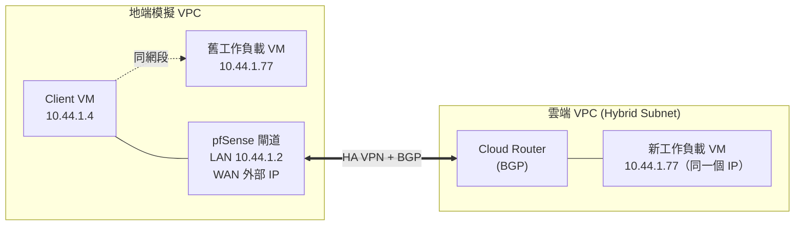
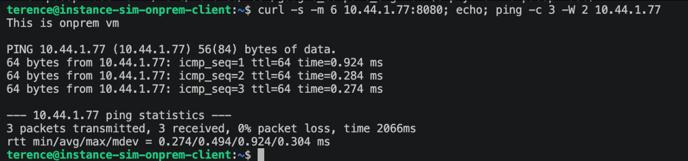
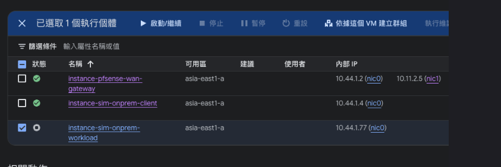
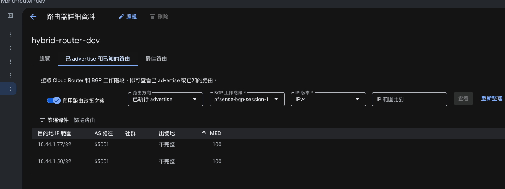
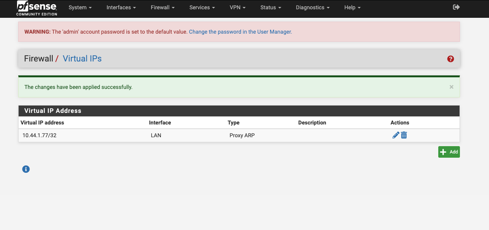
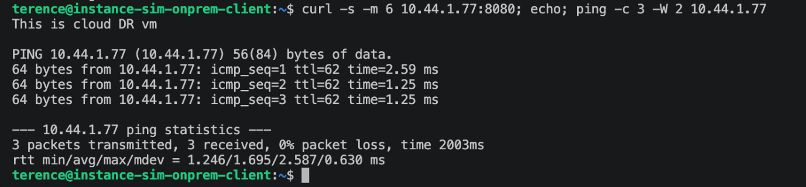

# GCP VPC Hybrid Subnets Lab（用 pfSense 模擬地端 ↔ 雲端遷移）

實際搭建並驗證 GCP [VPC Hybrid Subnets](https://cloud.google.com/vpc/docs/hybrid-subnets) 功能的完整紀錄：同一個內部 IP，工作負載從「地端」搬到雲端後，用戶端完全不用改任何設定就能無縫接上新的機器。

> 還沒有 pfSense 環境？可以先參考 [`pfsense-on-gcp`](https://github.com/terensy/pfsense-on-gcp) 這個 repo 把地端閘道部署起來，再回來做這邊的 Hybrid Subnets 測試。

## 這個功能在解決什麼問題

企業遷移上雲最常見的痛點之一：一台機器搬到雲端之後，IP 位址通常會變，所有還沒更新設定的用戶端、DNS、防火牆規則全部要跟著改，遷移窗口因此被綁得很死。

Hybrid Subnets 讓雲端的 VPC subnet 可以跟地端網路**共用同一段 CIDR**，遷移時新舊機器的 IP 位址可以完全一樣——用一條 host route（`/32`）逐台切換由誰回應這個位址，做到真正意義上的零停機遷移。

## 環境架構



- **地端模擬**：一個獨立 VPC，裡面有 pfSense（當地端的閘道/路由器）、一台 client、一台「舊」工作負載 VM
- **雲端**：另一個獨立 VPC（另一個 project），開了 `allowSubnetCidrRoutesOverlap`（Hybrid Subnet 的核心開關）的 subnet，裡面有一台「新」工作負載 VM，用**跟地端那台完全相同的內部 IP**
- 兩邊透過 **HA VPN + Cloud Router 動態 BGP** 連接

## 前置需求

- 兩個 GCP project（一個當雲端、一個模擬地端），或同一個 project 下兩個獨立 VPC 亦可
- 地端那邊已部署好 pfSense（見 [`pfsense-on-gcp`](https://github.com/terensy/pfsense-on-gcp)），並且：
  - LAN 介面所在的 subnet CIDR，跟雲端要用來接手的 subnet CIDR **完全相同**
  - pfSense 裝了 FRR 套件（跑 BGP 用）
- 雲端那個 subnet 已經開啟 hybrid subnet 支援：

```
gcloud compute networks subnets update <SUBNET_NAME> \
  --project=<CLOUD_PROJECT_ID> --region=<REGION> \
  --allow-subnet-cidr-routes-overlap
```

- 雲端 Cloud Router 已經跟 pfSense 建立好 HA VPN + BGP session（兩邊 status 都要是 `Established`）

## 測試 SOP

整套流程分四階段：量測基準 → 模擬 cutover → 驗證切換 → 完整復原。每個階段都用一支簡單的測試網頁（回應內容不同）來明確判斷當下是哪一台機器在回應，比單看 ping TTL 更直觀。

### 事前準備：兩台工作負載各架一個測試網頁

```bash
# 地端那台
ssh <onprem-workload> 'mkdir -p ~/www-test && echo "This is onprem vm" > ~/www-test/index.html && \
  (nohup python3 -m http.server 8080 --directory ~/www-test > /tmp/httpserver.log 2>&1 < /dev/null &)'

# 雲端那台
ssh <cloud-dr-workload> 'mkdir -p ~/www-test && echo "This is cloud DR vm" > ~/www-test/index.html && \
  (nohup python3 -m http.server 8080 --directory ~/www-test > /tmp/httpserver.log 2>&1 < /dev/null &)'
```

> ⚠️ **陷阱**：這個 `nohup` 程序只在該次開機期間存活。任何一次 `gcloud compute instances stop`，重開機後都要重新執行這條指令，不會自動復活。

### 階段 1 — 基準測試

從地端 client 打測試目標 IP，確認目前是「舊」機器在回應：

```bash
ssh <onprem-client> "curl -s -m 6 <TARGET_IP>:8080; echo; ping -c 3 <TARGET_IP>"
```

**預期**：網頁回應 `This is onprem vm`，`ttl=64`，RTT < 1ms（同網段直連）。

### 階段 2 — 模擬 Cutover

三個子步驟，順序不能顛倒：

**2.1 停用地端那台舊機器**（模擬它已經遷移走）

```bash
gcloud compute instances stop <onprem-workload> --project=<ONPREM_PROJECT_ID> --zone=<ZONE>
```

**2.2 雲端 Cloud Router 追加通告這個 host route**（兩個 BGP peer session 都要加，並保留原本已存在的其他通告）

```bash
gcloud compute routers update-bgp-peer <CLOUD_ROUTER> \
  --project=<CLOUD_PROJECT_ID> --region=<REGION> \
  --peer-name=<BGP_PEER_1> \
  --advertisement-mode=CUSTOM \
  --set-advertisement-ranges=<既有的其他/32,><TARGET_IP>/32

# 第二條 BGP session 重複同樣操作
```

**2.3 pfSense 開 Proxy ARP**，讓地端網段對這個 IP 的請求由 pfSense 代為接手（透過 pfSense shell / serial console 執行，實際做法見下方「常見陷阱」）：

在 pfSense WebGUI：Firewall → Virtual IPs → Add，Type 選 `Proxy ARP`，Interface 選 `LAN`，填入 `<TARGET_IP>/32`。也可以透過 shell 直接呼叫 `interface_proxyarp_configure()` 達到同樣效果。

### 階段 3 — 驗證切換

跟階段 1 一模一樣的指令，這次應該換雲端的機器回應：

```bash
ssh <onprem-client> "curl -s -m 6 <TARGET_IP>:8080; echo; ping -c 3 <TARGET_IP>"
```

**預期**：網頁回應變成 `This is cloud DR vm`，`ttl` 減少（多繞了 pfSense + 雲端路由這兩個 L3 hop），RTT 略微上升（走加密 VPN tunnel）。**同一個 IP，client 端完全沒有改任何設定**。

### 階段 4 — 完整復原

跟階段 2 的順序相反：

```bash
# 4.1 移除雲端 BGP 通告，改回原本的通告內容（不含 <TARGET_IP>/32）
gcloud compute routers update-bgp-peer <CLOUD_ROUTER> \
  --project=<CLOUD_PROJECT_ID> --region=<REGION> \
  --peer-name=<BGP_PEER_1> \
  --advertisement-mode=CUSTOM \
  --set-advertisement-ranges=<既有的其他/32>

# 4.2 重新啟動地端機器
gcloud compute instances start <onprem-workload> --project=<ONPREM_PROJECT_ID> --zone=<ZONE>

# 4.3 移除 pfSense 上的 Proxy ARP VIP（WebGUI 或 shell）

# 4.4 機器重開機後，記得手動重啟測試網頁（見上方陷阱提醒）
sleep 20
ssh <onprem-workload> '(nohup python3 -m http.server 8080 --directory ~/www-test > /tmp/httpserver.log 2>&1 < /dev/null &)'
```

最後再跑一次階段 1 的指令確認回到基準狀態。

## 實測結果

| 階段 | 網頁回應 | ping TTL | RTT |
|---|---|---|---|
| Cutover 前 | `This is onprem vm` | 64 | < 1ms |
| Cutover 後 | `This is cloud DR vm` | 62 | 1–3ms |
| 復原後 | `This is onprem vm` | 64 | < 1ms |







## 關鍵原理：Proxy ARP 跟「往哪送」是兩件事

實測過程中最容易搞混的一點：**Proxy ARP 本身不含任何路由資訊**，它只負責讓 pfSense「認領」這個 IP、讓封包不會被地端其他機器攔走。真正決定封包該送去哪裡的，是 pfSense 自己的路由表——透過 BGP 從 Cloud Router 學到的那條 `/32` host route。

完整因果鏈：

```
Proxy ARP（讓封包進得來 pfSense）
    → pfSense 查自己的路由表
    → 查到 BGP 學來的 /32 路由（下一跳指向 VPN tunnel）
    → 封包送進 IPsec tunnel，抵達雲端
```

兩者缺一不可，實測驗證過：只開 BGP 路由、不開 Proxy ARP，client 端連 ARP/neighbor 都解析不出來，完全連不上；只開 Proxy ARP、不通告 BGP 路由，封包會被 pfSense 接住但查無路由，繞一圈又送回地端本地。

另外一個重要發現：**GCP 的 VPC 網路沒有真正的乙太網路廣播 ARP**——同網段封包遞送完全靠 GCP 自己的路由表決定，在 pfSense 的實體介面上完全抓不到任何 ARP 封包。Proxy ARP 之所以有效，是透過 GCP 網路層面另一種尚未完全確認細節的機制生效，而不是傳統認知裡「回應 ARP 廣播」的方式。

## 常見陷阱

- **pfSense 的預設 shell 是 tcsh，不是 bash**：如果要透過 shell / serial console 貼多行、含 `$變數` 的 heredoc 去改設定，tcsh 對引號和變數展開的處理方式跟 bash 不一樣，容易貼壞。先輸入 `sh` 切到 Bourne shell 再貼指令。
- **VM 一旦被 `stop` 過，裡面所有非常駐服務都會消失**：測試網頁用的 `nohup` 程序、任何手動啟動的背景服務,重開機後都要手動重啟。
- **兩層防火牆要分開檢查**：GCP 的 VPC 防火牆規則、跟 pfSense 自己的防火牆規則是完全獨立的兩層，兩邊都要放行才通。出現「ping 通但特定 port 不通」這種現象，通常是其中一層只開了部分 protocol/port。

## 延伸閱讀

- [GCP 官方文件：Hybrid Subnets](https://cloud.google.com/vpc/docs/hybrid-subnets)
- [`pfsense-on-gcp`](https://github.com/terensy/pfsense-on-gcp) — 這個環境裡 pfSense 本身的部署方式

## License

MIT
