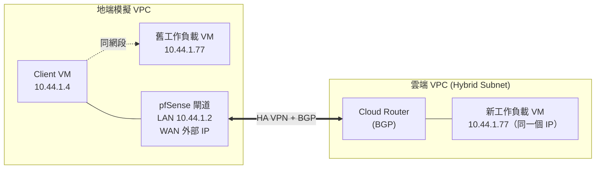

# GCP VPC Hybrid Subnets Lab（用 pfSense 模擬地端 ↔ 雲端遷移）

實際搭建並驗證 GCP [VPC Hybrid Subnets](https://cloud.google.com/vpc/docs/hybrid-subnets) 功能的完整紀錄：同一個內部 IP，工作負載從「地端」搬到雲端後，用戶端完全不用改任何設定就能無縫接上新的機器。

> 還沒有 pfSense 環境？可以先參考 [`pfsense-on-gcp`](https://github.com/terensy/pfsense-on-gcp) 這個 repo 把地端閘道部署起來，再回來做這邊的 Hybrid Subnets 測試。

## 這個功能在解決什麼問題

企業遷移上雲最常見的痛點之一：一台機器搬到雲端之後，IP 位址通常會變，所有還沒更新設定的用戶端、DNS、防火牆規則全部要跟著改，遷移窗口因此被綁得很死。

Hybrid Subnets 讓雲端的 VPC subnet 可以跟地端網路**共用同一段 CIDR**，遷移時新舊機器的 IP 位址可以完全一樣——用一條 host route（`/32`）逐台切換由誰回應這個位址，做到真正意義上的零停機遷移。

## 環境架構



- **地端模擬**：一個獨立 VPC，裡面有 pfSense（當地端的閘道/路由器）、一台 client、一台「舊」工作負載 VM
- **雲端**：另一個獨立 VPC（另一個 project），開了 `allowSubnetCidrRoutesOverlap`（Hybrid Subnet 的核心開關）的 subnet，裡面有一台「新」工作負載 VM，用**跟地端那台完全相同的內部 IP**
- 兩邊透過 **HA VPN + Cloud Router 動態 BGP** 連接

## 前置需求

- 兩個 GCP project（一個當雲端、一個模擬地端），或同一個 project 下兩個獨立 VPC 亦可
- 地端那邊已部署好 pfSense（見 [`pfsense-on-gcp`](https://github.com/terensy/pfsense-on-gcp)），並且 LAN 介面所在的 subnet CIDR，跟雲端要用來接手的 subnet CIDR **完全相同**
- 雲端跟 pfSense 之間的 HA VPN + BGP 連線基礎設施——如果還沒建，看下一節從零開始建

## 從零建立連線基礎設施

這節記錄怎麼把「一台裝好的 pfSense」跟「一個雲端 VPC」接成能跑 BGP 動態路由的 hybrid subnet 連線，做完這節，才會進入前置需求列的那個「Established」狀態。

### 架構決策

- **pfSense 用 WAN 介面直接終結新建的 HA VPN**，不透過 LAN：LAN 介面沒有對外 IP，雲端的 VPN Gateway 沒辦法透過公網連上；而且 VPN 終結點跟要做 Proxy ARP 的網段最好分開，避免 hairpin 造成路由/ARP 衝突。
- **另外建一組獨立的 HA VPN Gateway + Cloud Router**，不要跟這個 project 裡可能已存在的其他 VPN/Router 共用，避免路由混在一起難以排查。
- 用 **Route-based VPN（IKEv2 + VTI）+ BGP 動態路由**，不要用靜態路由——之後要逐台遷移 VM 時，動態廣播 `/32` 才有意義。
- ASN 規劃：雲端側 Cloud Router 用一個 ASN（例如 `65001`），pfSense 側用另一個（例如 `65002`），如果同一個 project 下還有其他 BGP 連線，記得互相錯開避免衝突。
- Cloud Router 的 BGP peer 一開始先設 `CUSTOM` 通告模式、**不放任何路徑**——等真的有 VM 要「遷移」了才逐一加 `/32`，這是官方建議的漸進式做法，避免一次廣播整個 CIDR 跟地端現有主機衝突。

### 建立 Hybrid Subnet（雲端 project）

```bash
gcloud beta compute networks subnets create <HYBRID_SUBNET_NAME> \
  --project=<CLOUD_PROJECT_ID> \
  --network=<CLOUD_VPC_NAME> \
  --region=<REGION> \
  --range=<SHARED_CIDR>/24 \
  --allow-cidr-routes-overlap
```

`<SHARED_CIDR>` 要跟地端 pfSense LAN 介面的 subnet CIDR 完全一樣。

### 建立獨立的 HA VPN + Cloud Router（雲端 project）

```bash
# HA VPN Gateway
gcloud compute vpn-gateways create hybrid-vpn-gateway-dev \
  --project=<CLOUD_PROJECT_ID> --region=<REGION> \
  --network=<CLOUD_VPC_NAME>
# 會拿到兩個公網 IP（interface0 / interface1）

# External VPN Gateway，代表 pfSense（單一公網 IP）
gcloud compute external-vpn-gateways create pfsense-peer-gw \
  --project=<CLOUD_PROJECT_ID> \
  --interfaces=0=<PFSENSE_WAN_EXTERNAL_IP>

# Cloud Router
gcloud compute routers create hybrid-router-dev \
  --project=<CLOUD_PROJECT_ID> --region=<REGION> \
  --network=<CLOUD_VPC_NAME> --asn=65001

# 兩條 tunnel（HA VPN 至少要兩條）
gcloud compute vpn-tunnels create hybrid-dev-2-pfsense-1 \
  --project=<CLOUD_PROJECT_ID> --region=<REGION> \
  --vpn-gateway=hybrid-vpn-gateway-dev --interface=0 \
  --peer-external-gateway=pfsense-peer-gw --peer-external-gateway-interface=0 \
  --ike-version=2 --shared-secret='<TUNNEL1_PSK>' \
  --router=hybrid-router-dev

gcloud compute vpn-tunnels create hybrid-dev-2-pfsense-2 \
  --project=<CLOUD_PROJECT_ID> --region=<REGION> \
  --vpn-gateway=hybrid-vpn-gateway-dev --interface=1 \
  --peer-external-gateway=pfsense-peer-gw --peer-external-gateway-interface=0 \
  --ike-version=2 --shared-secret='<TUNNEL2_PSK>' \
  --router=hybrid-router-dev

# Router 介面 + BGP peer（兩條 tunnel 各做一次，interface-name 換掉）
gcloud compute routers add-interface hybrid-router-dev \
  --project=<CLOUD_PROJECT_ID> --region=<REGION> \
  --interface-name=if-hybrid-session-1 --vpn-tunnel=hybrid-dev-2-pfsense-1

gcloud compute routers add-bgp-peer hybrid-router-dev \
  --project=<CLOUD_PROJECT_ID> --region=<REGION> \
  --peer-name=pfsense-bgp-session-1 --interface=if-hybrid-session-1 \
  --peer-asn=65002 --advertisement-mode=CUSTOM
```

> Pre-shared key 請自己用密碼產生器生成，不要寫進任何會進版控的檔案。

### pfSense 端：IPsec Phase 1/2

`VPN > IPsec > Tunnels`，兩條 Phase 1，都選 **Route-based（Phase 2 選 Routed / VTI）**：

- Key Exchange：IKEv2
- Interface：WAN
- Auth：Mutual PSK
- My/Peer identifier：My IP address / Peer IP address
- Encryption：AES 256 / SHA256 / DH Group 14
- Phase 2 Local/Remote Tunnel Address：對應雲端那邊 BGP session 的 link-local `/30`

### pfSense 端：FRR（BGP daemon）

`Services > FRR`：

- **Global/Zebra**：Enable，Router ID 填 pfSense LAN IP
- **BGP**：Enable，Local AS 填 `65002`，Networks to Distribute 先留空
- **Neighbors**（兩條 tunnel 各一個）：Peer IP 填雲端那邊的 link-local IP，Remote AS 填 `65001`，Update Source 選 Default 即可——VTI 介面是點對點 `/30`，FRR 會自動用連通路由找到正確介面，不需要額外把 tunnel 介面指派成正式 pfSense 介面。

### 驗證連線是否建立成功

```bash
gcloud compute vpn-tunnels list --project=<CLOUD_PROJECT_ID>
# 兩條都要是 "Tunnel is up and running."

gcloud compute routers get-status hybrid-router-dev \
  --project=<CLOUD_PROJECT_ID> --region=<REGION>
# 兩個 BGP peer 都要是 state: Established / status: UP
```

pfSense 側對應在 `Services > FRR > BGP > Status` 也要看到兩個 neighbor 是 `BGP state = Established`。這個階段 `0 accepted prefixes` 是正常的——兩邊都還沒放 custom advertisement。

## 測試 SOP

整套流程分四階段：量測基準 → 模擬 cutover → 驗證切換 → 完整復原。每個階段都用一支簡單的測試網頁（回應內容不同）來明確判斷當下是哪一台機器在回應，比單看 ping TTL 更直觀。

### 事前準備：兩台工作負載各架一個測試網頁

```bash
# 地端那台
ssh <onprem-workload> 'mkdir -p ~/www-test && echo "This is onprem vm" > ~/www-test/index.html && \
  (nohup python3 -m http.server 8080 --directory ~/www-test > /tmp/httpserver.log 2>&1 < /dev/null &)'

# 雲端那台
ssh <cloud-dr-workload> 'mkdir -p ~/www-test && echo "This is cloud DR vm" > ~/www-test/index.html && \
  (nohup python3 -m http.server 8080 --directory ~/www-test > /tmp/httpserver.log 2>&1 < /dev/null &)'
```

> ⚠️ **陷阱**：這個 `nohup` 程序只在該次開機期間存活。任何一次 `gcloud compute instances stop`，重開機後都要重新執行這條指令，不會自動復活。

### 階段 1 — 基準測試

從地端 client 打測試目標 IP，確認目前是「舊」機器在回應：

```bash
ssh <onprem-client> "curl -s -m 6 <TARGET_IP>:8080; echo; ping -c 3 <TARGET_IP>"
```

**預期**：網頁回應 `This is onprem vm`，`ttl=64`，RTT < 1ms（同網段直連）。

### 階段 2 — 模擬 Cutover

三個子步驟，順序不能顛倒：

**2.1 停用地端那台舊機器**（模擬它已經遷移走）

```bash
gcloud compute instances stop <onprem-workload> --project=<ONPREM_PROJECT_ID> --zone=<ZONE>
```

**2.2 雲端 Cloud Router 追加通告這個 host route**（兩個 BGP peer session 都要加，並保留原本已存在的其他通告）

```bash
gcloud compute routers update-bgp-peer <CLOUD_ROUTER> \
  --project=<CLOUD_PROJECT_ID> --region=<REGION> \
  --peer-name=<BGP_PEER_1> \
  --advertisement-mode=CUSTOM \
  --set-advertisement-ranges=<既有的其他/32,><TARGET_IP>/32

# 第二條 BGP session 重複同樣操作
```

**2.3 pfSense 開 Proxy ARP**，讓地端網段對這個 IP 的請求由 pfSense 代為接手（透過 pfSense shell / serial console 執行，實際做法見下方「常見陷阱」）：

在 pfSense WebGUI：Firewall → Virtual IPs → Add，Type 選 `Proxy ARP`，Interface 選 `LAN`，填入 `<TARGET_IP>/32`。也可以透過 shell 直接呼叫 `interface_proxyarp_configure()` 達到同樣效果。

### 階段 3 — 驗證切換

跟階段 1 一模一樣的指令，這次應該換雲端的機器回應：

```bash
ssh <onprem-client> "curl -s -m 6 <TARGET_IP>:8080; echo; ping -c 3 <TARGET_IP>"
```

**預期**：網頁回應變成 `This is cloud DR vm`，`ttl` 減少（多繞了 pfSense + 雲端路由這兩個 L3 hop），RTT 略微上升（走加密 VPN tunnel）。**同一個 IP，client 端完全沒有改任何設定**。

### 階段 4 — 完整復原

跟階段 2 的順序相反：

```bash
# 4.1 移除雲端 BGP 通告，改回原本的通告內容（不含 <TARGET_IP>/32）
gcloud compute routers update-bgp-peer <CLOUD_ROUTER> \
  --project=<CLOUD_PROJECT_ID> --region=<REGION> \
  --peer-name=<BGP_PEER_1> \
  --advertisement-mode=CUSTOM \
  --set-advertisement-ranges=<既有的其他/32>

# 4.2 重新啟動地端機器
gcloud compute instances start <onprem-workload> --project=<ONPREM_PROJECT_ID> --zone=<ZONE>

# 4.3 移除 pfSense 上的 Proxy ARP VIP（WebGUI 或 shell）

# 4.4 機器重開機後，記得手動重啟測試網頁（見上方陷阱提醒）
sleep 20
ssh <onprem-workload> '(nohup python3 -m http.server 8080 --directory ~/www-test > /tmp/httpserver.log 2>&1 < /dev/null &)'
```

最後再跑一次階段 1 的指令確認回到基準狀態。

## 實測結果

| 階段 | 網頁回應 | ping TTL | RTT |
|---|---|---|---|
| Cutover 前 | `This is onprem vm` | 64 | < 1ms |
| Cutover 後 | `This is cloud DR vm` | 62 | 1–3ms |
| 復原後 | `This is onprem vm` | 64 | < 1ms |


## 關鍵原理：Proxy ARP 跟「往哪送」是兩件事

實測過程中最容易搞混的一點：**Proxy ARP 本身不含任何路由資訊**，它只負責讓 pfSense「認領」這個 IP、讓封包不會被地端其他機器攔走。真正決定封包該送去哪裡的，是 pfSense 自己的路由表——透過 BGP 從 Cloud Router 學到的那條 `/32` host route。

完整因果鏈：

```
Proxy ARP（讓封包進得來 pfSense）
    → pfSense 查自己的路由表
    → 查到 BGP 學來的 /32 路由（下一跳指向 VPN tunnel）
    → 封包送進 IPsec tunnel，抵達雲端
```

兩者缺一不可，實測驗證過：只開 BGP 路由、不開 Proxy ARP，client 端連 ARP/neighbor 都解析不出來，完全連不上；只開 Proxy ARP、不通告 BGP 路由，封包會被 pfSense 接住但查無路由，繞一圈又送回地端本地。

另外一個重要發現：**GCP 的 VPC 網路沒有真正的乙太網路廣播 ARP**——同網段封包遞送完全靠 GCP 自己的路由表決定，在 pfSense 的實體介面上完全抓不到任何 ARP 封包。Proxy ARP 之所以有效，是透過 GCP 網路層面另一種尚未完全確認細節的機制生效，而不是傳統認知裡「回應 ARP 廣播」的方式。

## 常見陷阱

### 測試階段

- **pfSense 的預設 shell 是 tcsh，不是 bash**：如果要透過 shell / serial console 貼多行、含 `$變數` 的 heredoc 去改設定，tcsh 對引號和變數展開的處理方式跟 bash 不一樣，容易貼壞。先輸入 `sh` 切到 Bourne shell 再貼指令。
- **VM 一旦被 `stop` 過，裡面所有非常駐服務都會消失**：測試網頁用的 `nohup` 程序、任何手動啟動的背景服務,重開機後都要手動重啟。
- **兩層防火牆要分開檢查**：GCP 的 VPC 防火牆規則、跟 pfSense 自己的防火牆規則是完全獨立的兩層，兩邊都要放行才通。出現「ping 通但特定 port 不通」這種現象，通常是其中一層只開了部分 protocol/port。

### 建置連線基礎設施階段

- **地端 LAN 那個 subnet 也要開 `allow-cidr-routes-overlap`**，不只是雲端那個 hybrid subnet。原因是要在地端 VPC 裡建立比 subnet 本身 `/24` 更精確的靜態路由（見下一點），沒開這個旗標，建路由時會直接報錯 `hides the address space of the network`：

  ```bash
  gcloud beta compute networks subnets update <ONPREM_LAN_SUBNET> \
    --project=<ONPREM_PROJECT_ID> --region=<REGION> \
    --allow-cidr-routes-overlap
  ```

- **地端 VPC 裡也需要一條靜態路由，把「目的地是遷移中 VM」的流量導去 pfSense**——這正是我們在測試 SOP 裡「不需要另外設定」但其實已經存在的關鍵路由：

  ```bash
  gcloud compute routes create route-to-dr-vm \
    --project=<ONPREM_PROJECT_ID> --network=<ONPREM_LAN_VPC> \
    --destination-range=<TARGET_IP>/32 \
    --next-hop-instance=<PFSENSE_INSTANCE_NAME> \
    --next-hop-instance-zone=<ZONE> --priority=100
  ```

  用 `--next-hop-instance` 需要該 instance 開啟 `--can-ip-forward`。

- **兩邊 BGP 通告的方向刻意不對稱**：雲端 Cloud Router 只通告「已遷移」VM 的 `/32`；pfSense（FRR）反過來要通告**整個共用 CIDR**（`Services > FRR > BGP > Networks to Distribute` 填 `/24`），不是也精確通告 `/32`。原因是雲端 hybrid subnet 有個「找不到對應資源就 fallback 到地端」的機制，需要地端這條粗粒度路由才有東西可以 fallback，少了它,任何雲端不認得的位址都無路可走。

- **FRR 的 `network` 廣播語句，需要 kernel routing table 裡有一條「active」的精確匹配路由**：pfSense 在 GCP 上的介面是 `/32` 點對點定址，系統自動產生的 `<CIDR> via <介面閘道>` 這條路由預設是 inactive 狀態，FRR 找不到東西可廣播。修法是在該介面下手動建一個 Gateway（IP 填該 subnet 的隱含閘道，例如 `x.x.x.1`，並勾選 **Far Gateway**——因為 GCP 用 `/32` 定址，Gateway 天生「不在」介面子網路範圍內，不勾這個表單驗證會擋下來），再加一條對應的 Static Route 讓它變成 active。這條路由本身不會真的拿去轉送封包（更精確的路由永遠優先），純粹是讓 FRR 有東西可以匹配廣播。

  > 小陷阱：Static Route 表單的 Destination network 欄位只填網路位址（例如 `10.44.1.0`），遮罩要用旁邊獨立的下拉選單選，不要把 `/24` 一起打進文字框，否則會跟下拉選單預設值衝突報錯。

- **Cloud Router 預設不接受「跟自己 VPC 子網路重疊」的 BGP 學來路由**：就算 BGP session 顯示 Established、pfSense 也確實有在送 `network` 廣播,雲端這邊的 `numLearnedRoutes` 還是會是 0。要顯式把重疊的 CIDR 加進白名單：

  ```bash
  gcloud compute routers update-bgp-peer hybrid-router-dev \
    --project=<CLOUD_PROJECT_ID> --region=<REGION> \
    --peer-name=pfsense-bgp-session-1 \
    --set-custom-learned-route-ranges=<SHARED_CIDR>/24
  # 另一個 BGP session 同樣操作
  ```

- **FRR 預設開啟 `ebgp-requires-policy`（RFC 8212）**：每個 eBGP neighbor 沒有明確掛 policy（route-map/prefix-list），就完全不交換任何路由——就算 session 顯示 Established 也一樣（neighbor detail 會看到 `Inbound/Outbound updates discarded due to missing policy`）。Lab 環境圖方便可以直接關掉：`Services > FRR > BGP > Advanced > eBGP`，勾選 **Disable eBGP Require Policy**。改完要**強制重置 BGP session** 才會套用（單純存檔/reload 不會生效）：

  ```bash
  /usr/local/bin/vtysh -c "clear bgp *"
  ```

  （`vtysh` 不在預設 PATH 裡，要用完整路徑。）

- **custom-mode VPC 不會自動生成內部互通的防火牆規則**，兩邊 VPC 都要手動補：

  ```bash
  # 雲端：讓地端 LAN 打得進雲端 hybrid subnet
  gcloud compute firewall-rules create allow-onprem-lan-in \
    --project=<CLOUD_PROJECT_ID> --network=<CLOUD_VPC_NAME> \
    --direction=INGRESS --action=ALLOW --rules=icmp,tcp:22 \
    --source-ranges=<SHARED_CIDR>/24

  # 地端：LAN 內部（client <-> pfSense 等）本來就完全沒有允許規則
  gcloud compute firewall-rules create allow-trust-vpc-internal \
    --project=<ONPREM_PROJECT_ID> --network=<ONPREM_LAN_VPC> \
    --direction=INGRESS --action=ALLOW --rules=icmp,tcp,udp \
    --source-ranges=<SHARED_CIDR>/24
  ```

- **pfSense 自己的 LAN 防火牆規則預設是空的（如果是用腳本/API 建機器、沒走過安裝精靈），而且內建的「LAN subnets」別名有 `/32` 陷阱**：pfSense 的 LAN 介面在 GCP 上一樣是 `/32` 點對點定址,如果沒被改成 Static，內建的 **"LAN subnets" 別名只會展開成 pfSense 自己那個 `/32`**，不是整個 `/24`——用這個別名當 Source 建的放行規則,其他所有 LAN 端主機的流量永遠比對不到，會持續被最底層的 Default deny 擋掉，而且 log 未必明顯（規則 States 一直是 `0/0 B`,不容易第一時間發現是別名的問題）。修法：規則的 Source 不要選 "LAN subnets" 別名，改成 **Network 型別，手動填整個 `<SHARED_CIDR>/24`**。

## 為什麼 Proxy ARP 在這裡不是「靠它就夠了」

Proxy ARP 是設計給真實地端「實體 L2 廣播網域」用的機制：同網段主機真的會送出 ARP 廣播，地端路由器攔截並代答。但 GCP 的 VPC 網路不是真正的 L2 廣播網域，每台 VM 是 `/32` 點對點定址、由 SDN 控制平面直接解析——不會有真實的廣播 ARP 讓 pfSense 攔截。也因此，地端網段裡其他 VM 的流量不會自動被 pfSense 的 Proxy ARP 攔下來；要讓封包真的送到 pfSense、轉送進 tunnel，前面「建置連線基礎設施」提到的那條 **VPC 靜態路由才是真正決定封包流向的關鍵**。Proxy ARP 還是建議開著（行為才會跟接上真實地端網路時一致），但在這個 GCE 模擬環境裡，它不是唯一、甚至不是主要的決定因素。

## 延伸閱讀

- [GCP 官方文件：Hybrid Subnets](https://cloud.google.com/vpc/docs/hybrid-subnets)
- [`pfsense-on-gcp`](https://github.com/terensy/pfsense-on-gcp) — 這個環境裡 pfSense 本身的部署方式

## License

MIT
