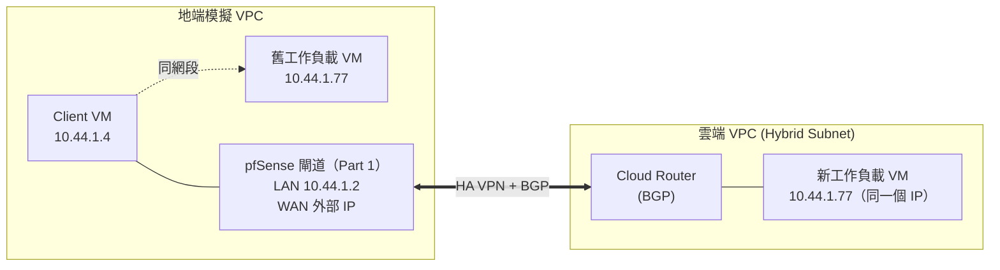
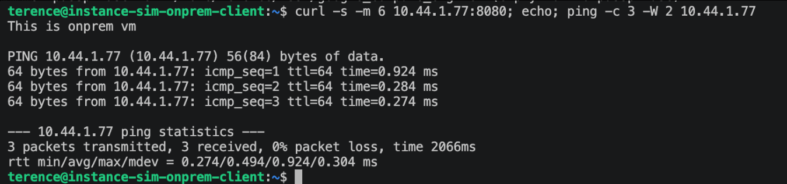
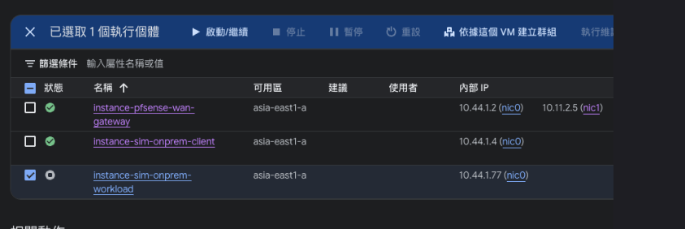
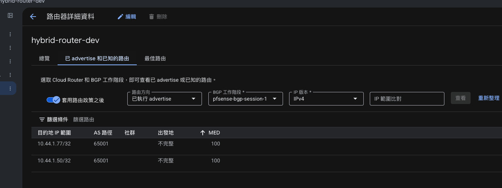
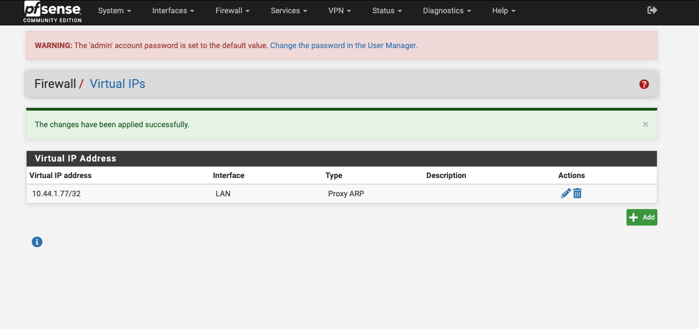
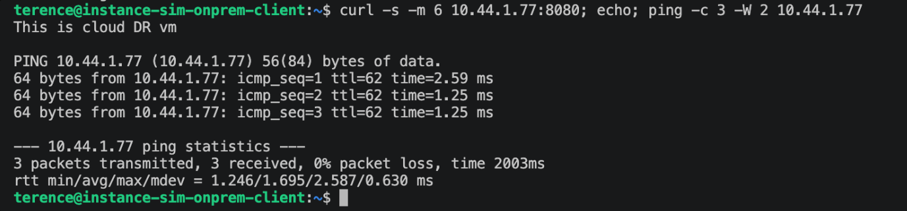

**繁體中文** | [English](README.en.md)

# GCP VPC Hybrid Subnets 實測：用 pfSense 模擬地端網路做零停機遷移

實際搭建並驗證 GCP [VPC Hybrid Subnets](https://cloud.google.com/vpc/docs/hybrid-subnets) 功能的完整紀錄：同一個內部 IP，工作負載從「地端」搬到雲端後，用戶端完全不用改任何設定就能無縫接上新的機器。

這份文件原本是兩個獨立的 repo——一份 pfSense on GCP 部署指南，加上一份 Hybrid Subnets 測試紀錄——因為兩者其實是同一套環境裡先後兩個步驟，現在合併成一份，照著順序做完就能從一個空的 GCP project，一路建到驗證過的零停機 cutover。

> **請依序閱讀**：[Part 1](#part-1--在-gcp-上部署-pfsense作為模擬地端閘道) 建立模擬地端閘道用的 pfSense VM；[Part 2](#part-2--gcp-vpc-hybrid-subnets-遷移實測) 拿這台 pfSense 去跑真正的 Hybrid Subnets cutover 測試。如果你已經在 GCP 上有一台可用的 pfSense 閘道、LAN 介面也能正常路由，可以直接跳到 Part 2。

## 目錄

- [Part 1 — 在 GCP 上部署 pfSense（作為模擬地端閘道）](#part-1--在-gcp-上部署-pfsense作為模擬地端閘道)
  - [為什麼要在 GCP 上跑 pfSense](#為什麼要在-gcp-上跑-pfsense)
  - [部署流程](#部署流程)
  - [安全性提醒](#️-安全性提醒)
  - [環境驗證對照表](#環境驗證對照表)
- [Part 2 — GCP VPC Hybrid Subnets 遷移實測](#part-2--gcp-vpc-hybrid-subnets-遷移實測)
  - [這個功能在解決什麼問題](#這個功能在解決什麼問題)
  - [環境架構](#環境架構)
  - [前置需求](#前置需求)
  - [從零建立連線基礎設施](#從零建立連線基礎設施)
  - [測試 SOP](#測試-sop)
  - [實測結果](#實測結果)
  - [關鍵原理：Proxy ARP 跟「往哪送」是兩件事](#關鍵原理proxy-arp-跟往哪送是兩件事)
  - [常見陷阱](#常見陷阱)
  - [為什麼 Proxy ARP 在這裡不是「靠它就夠了」](#為什麼-proxy-arp-在這裡不是靠它就夠了)
- [延伸閱讀](#延伸閱讀)
- [License](#license)

---

## Part 1 — 在 GCP 上部署 pfSense（作為模擬地端閘道）

一份實際部署並驗證過的 pfSense on GCP 安裝指南。內容基於下面兩個參考來源，並用一個實際跑在 GCP 上、有雙 VPC（trust/untrust）、HA VPN + BGP 的 pfSense 環境做交叉驗證與補充。

**參考來源**

- [Deploying pfSense in Google Cloud](https://blog.matrixpost.net/deploying-pfsense-in-google-cloud-a-step-by-step-guide-to-your-own-cloud-firewall/) — 完整部署流程的主要參考
- [Netgate 官方映像檔下載鏡像](https://atxfiles.netgate.com/mirror/downloads/) — pfSense CE 各版本 ISO / IMG 下載

### 為什麼要在 GCP 上跑 pfSense

GCE VM 本身沒有內建的軟體防火牆/路由器產品，如果需要：

- 集中管理進出雲端 VPC 的流量
- 模擬地端網路環境（用來測試遷移、混合雲架構，例如 Hybrid Subnets——見 [Part 2](#part-2--gcp-vpc-hybrid-subnets-遷移實測)）
- 需要 pfSense 特有功能（Proxy ARP、easyrule、FRR 動態路由套件）

就得自己把 pfSense 的映像檔做出來、部署成一般的 Compute Engine VM。GCP 官方 Marketplace 沒有現成的 pfSense CE 映像，所以整個流程是手動的。

### 部署流程

整體是「先做出一顆裝好 pfSense 的磁碟，snapshot 起來，之後所有正式機器都從這顆 snapshot 開機」的兩階段流程，不是把安裝媒體直接當開機映像檔用。

#### 1. 下載安裝映像檔 —— 一定要選 `memstick-serial`

從 [Netgate 官方鏡像站](https://atxfiles.netgate.com/mirror/downloads/) 下載 pfSense CE 的 **`memstick-serial`** 變體（本文撰寫時最新為 2.7.2）：

```
wget https://atxfiles.netgate.com/mirror/downloads/pfSense-CE-memstick-serial-2.7.2-RELEASE-amd64.img.gz
gunzip pfSense-CE-memstick-serial-2.7.2-RELEASE-amd64.img.gz
mv pfSense-CE-memstick-serial-2.7.2-RELEASE-amd64.img disk.raw
```

**為什麼一定要是 `-serial` 版本，不能用一般的 `memstick` 或 ISO**：GCE 的 VM 沒有 VGA/圖形主控台可用，能連上的只有序列埠（`gcloud compute connect-to-serial-port`，對應 VM 裡的 `ttyS0`）。一般的 memstick 映像開機時安裝精靈是往 VGA 輸出，在 GCE 上等於完全看不到任何畫面、也無法互動；只有 `memstick-serial` 這個變體會把安裝精靈的輸出導到序列埠，才能透過 GCP 的序列主控台看到、操作整個安裝流程。這是全部流程裡最容易選錯、選錯就直接卡死在第一步的地方。

> ⚠️ **2026 年更新提醒**：Netgate 後來改了 pfSense CE 的官方發布方式。`docs.netgate.com` 現在把 2.7.2 列為**「Older/Unsupported」**，目前的穩定版是 2.8.1，2.9.0 也已列入現行/即將推出的版本。[官方下載頁面](https://www.pfsense.org/download/)現在導向免費的 **Netgate Installer**——一個小型開機映像（仍然有 `memstick-serial` 格式），需要一個免費的 Netgate Store 帳號，而且是**開機後才連網抓實際的 pfSense 版本來安裝**，不再是一個可以直接 `wget` 下來的完整 `.img.gz`。本文件使用的舊版鏡像站（`atxfiles.netgate.com`）截至撰寫時仍在線上，但只提供到已經 EOL 的 2.7.2。下面的步驟，就是作者實際建置、驗證過、而且到現在都還在跑（HA VPN + BGP，已運作一段時間）的環境，這裡把它保留為已驗證的基準做法。如果你想改用官方目前主推的 Netgate Installer 流程，GCP 這邊「兩張網卡的臨時安裝機 → 裝進第二顆磁碟 → snapshot → 建正式映像」的特有作法應該仍然適用，但這條新路徑本文件還沒有實機驗證過。

GCP 自訂映像檔要求檔名為 `disk.raw`、並且打包成 `.tar.gz`：

```
tar --format=oldgnu -Sczf pfsense-installer-2.7.2-amd64.tar.gz disk.raw
```

上傳到 GCS bucket，建立**安裝用的映像檔**（注意：這顆映像檔開機後是「安裝精靈」，不是已經裝好的系統，之後只會拿來建立下一步的臨時安裝機）：

```
gsutil cp pfsense-installer-2.7.2-amd64.tar.gz gs://<YOUR_BUCKET>/

gcloud compute images create pfsense-installer-2-7-2 \
  --source-uri=gs://<YOUR_BUCKET>/pfsense-installer-2.7.2-amd64.tar.gz \
  --project=<YOUR_PROJECT_ID>
```

#### 2. 規劃網路：WAN / LAN 各一個 VPC

pfSense 至少需要兩張網卡：一張接 untrusted（WAN，對外/對上游），一張接 trusted（LAN，內部網段）。GCP 的作法是**兩個獨立的 VPC，各給一個 subnet**，VM 建立時掛兩張 NIC：

```
gcloud compute networks create untrust-vpc --subnet-mode=custom
gcloud compute networks subnets create wan-subnet \
  --network=untrust-vpc --region=<REGION> --range=10.11.2.0/24

gcloud compute networks create trust-vpc --subnet-mode=custom
gcloud compute networks subnets create lan-subnet \
  --network=trust-vpc --region=<REGION> --range=10.44.1.0/24
```

#### 3. 建立臨時安裝機（兩顆磁碟）並跑安裝精靈

這台機器只是「臨時工」，用完就丟，目的是把 pfSense 實際裝進第二顆磁碟：

- **磁碟 1（開機磁碟）**：用上一步建立的 `pfsense-installer-2-7-2` 映像檔——這是安裝精靈，負責開機
- **磁碟 2（安裝目標）**：一顆全新的空白磁碟（建議 20GB），安裝精靈會把 pfSense 實際裝進**這一顆**

```
gcloud compute instances create pfsense-installer-temp \
  --project=<YOUR_PROJECT_ID> \
  --zone=<ZONE> \
  --machine-type=e2-medium \
  --image=pfsense-installer-2-7-2 \
  --create-disk=name=pfsense-target-disk,size=20GB,auto-delete=no \
  --network-interface=subnet=lan-subnet,no-address \
  --network-interface=subnet=wan-subnet \
  --metadata=serial-port-enable=true
```

`auto-delete=no` 很重要——這顆磁碟裝完之後要拿去做 snapshot，VM 刪掉時不能連磁碟一起被清掉。

透過 serial console 連上去跑安裝精靈：

```
gcloud compute connect-to-serial-port pfsense-installer-temp \
  --project=<YOUR_PROJECT_ID> --zone=<ZONE>
```

依序：接受授權聲明 → 選 *Install pfSense* → 選檔案系統（ZFS 或 UFS 皆可）→ **安裝目標選第二顆磁碟（磁碟 2，不是開機用的磁碟 1）** → 確認開始安裝 → 裝完選 *Shell* → 執行 `poweroff` 關機。

#### 4. 把裝好的磁碟做成可重複使用的正式映像檔

VM 關機後，對**磁碟 2**（`pfsense-target-disk`，實際裝了 pfSense 的那顆）建立 snapshot，再從 snapshot 建立正式映像檔：

```
gcloud compute disks snapshot pfsense-target-disk \
  --project=<YOUR_PROJECT_ID> --zone=<ZONE> \
  --snapshot-names=pfsense-2-7-2-installed-snapshot

gcloud compute images create pfsense-2-7-2-amd64 \
  --project=<YOUR_PROJECT_ID> \
  --source-snapshot=pfsense-2-7-2-installed-snapshot
```

之後任何一台正式 pfSense instance，開機映像都用**這個從 snapshot 建出來的 `pfsense-2-7-2-amd64`**，不是第 1 步那個安裝用的 `pfsense-installer-2-7-2`。做完這步，臨時安裝機（`pfsense-installer-temp`）跟它的磁碟就可以刪了。

#### 5. 建立正式 pfSense VM

```
gcloud compute instances create pfsense-gateway \
  --project=<YOUR_PROJECT_ID> \
  --zone=<ZONE> \
  --machine-type=e2-medium \
  --image=pfsense-2-7-2-amd64 \
  --can-ip-forward \
  --network-interface=subnet=lan-subnet,no-address \
  --network-interface=subnet=wan-subnet \
  --tags=pfsense \
  --metadata=serial-port-enable=true
```

幾個關鍵旗標，都是 pfSense 能不能正常當閘道的必要條件：

| 旗標 | 為什麼需要 |
|---|---|
| `--can-ip-forward` | GCP 預設會丟棄來源/目的地不是 VM 自己 IP 的封包。這個旗標**是掛在 VM 上，不是個別網卡**，兩張 NIC 都會生效。沒開這個，pfSense 完全沒辦法轉送任何流量。 |
| 第一個 `--network-interface`（LAN，`no-address`） | GCP 會把**第一張**網卡當作主要介面。LAN 通常不需要對外 IP，用 `no-address` 省一個公有 IP。 |
| 第二個 `--network-interface`（WAN，有對外 IP） | 對外流量的出口，預設會拿到一個外部 NAT IP。 |
| `--metadata=serial-port-enable=true` | 沒有這個就不能用 `gcloud compute connect-to-serial-port` 做初始設定或緊急維護，等於失去唯一的頻外管理通道。 |

實際跑起來的環境長這樣（兩個 project 分別代表雲端跟模擬地端，實際名稱請替換成你自己的）：

```
NAME                          NIC0 (LAN)     NIC1 (WAN)              對外 IP
instance-pfsense-wan-gateway  10.44.1.2      10.11.2.5                <WAN_EXTERNAL_IP>
```

#### 6. 初始設定

第一次開機後透過 serial console 連上去（跟第 3 步同樣的指令，換成正式機器名稱）。注意三個 GCP 特有的坑：

**(a) MTU** — GCP VPC 的預設 MTU 是 1460（不是傳統的 1500），WAN/LAN 介面都要調整，否則某些連線會出現詭異的封包分片問題：

```
ifconfig vtnet0 mtu 1460
ifconfig vtnet1 mtu 1460
```

**(b) 介面用 DHCP，不要手動配 IP** — GCP 是靠自己的 DHCP server 把 subnet 裡配好的位址發給 VM，LAN 介面設定成 DHCP 即可（我們實際環境的 `config.xml` 裡 LAN 介面就是 `<ipaddr>dhcp</ipaddr>`）。

**(c) WAN 介面沒有預設閘道** — GCP 只有 VM 的**第一張網卡（nic0）**，DHCP 才會附帶預設閘道；pfSense 的 WAN 介面通常接在第二張網卡（untrust VPC，nic1），DHCP 只會給 IP、不會給 gateway，導致 pfSense 完全連不上網際網路（`ping 8.8.8.8` 100% 掉包）。修法：

1. WAN 介面改成 **Static IPv4**，IP 填 GCP 分配給這張網卡的位址、遮罩 `/32`（GCP 對每張網卡都是點對點定址）
2. 到 `System > Routing > Gateways` 手動新增一個 Gateway，IP 填該 subnet 的隱含閘道（通常是該 CIDR 的 `.1`，例如 `10.11.2.0/24` 對應 `10.11.2.1`），並且**務必勾選 Far Gateway**——因為 GCP 用 `/32` 定址，這個 Gateway IP 天生「不在」介面自己的子網路範圍內，pfSense 表單預設驗證會擋下來，Far Gateway 就是用來繞過這個檢查
3. 把這個 Gateway 指定成 WAN 介面的 upstream gateway，不要依賴 DHCP 帶來的 gateway 資訊

#### 7. 連上網際網路：DNS 與套件庫疑難排解

裝好基本網路設定後，還有兩個常見卡點會讓 pfSense 看起來「介面正常、但實際用不了」：

**DNS 解析卡住** — DNS Resolver（Unbound）預設用完整遞迴解析（跟 root DNS server 直接對話），在部分雲端網路環境會卡住沒有回應。修法：`Services > DNS Resolver` 開啟 **Enable DNS Query Forwarding**，改用 `System > General Setup` 設定的上游 DNS（例如 `8.8.8.8` / `8.8.4.4`）。如果 log 顯示卡在 root trust anchor 的 `_ta` keytag 查詢，通常是 DNSSEC 相關的大型 UDP 封包在雲端環境被丟包，可以先把 **DNSSEC** 關掉排除。

**Package Manager 抓不到套件清單** — 如果 GUI 一直顯示抓不到套件、看起來像是官方套件庫掛掉了，先不要急著懷疑網域本身有問題：pfSense 的 repo 設定用的是 **SRV 記錄**查詢（`pkg01-atx.netgate.com` / `pkg00-atx.netgate.com` 這類主機名），不是一般的 A 記錄，用 `dig`/`nslookup` 查 A 記錄查不到是正常的，要查 SRV 才查得到。實際能不能連通，直接用 shell 測試最準：

```
pkg-static update
```

如果這條指令能正常抓到 repo，GUI 上顯示的錯誤通常只是先前失敗時的快取沒更新，重新整理 Available Packages 頁面即可恢復正常。

#### 8. WebGUI 存取與 Referer 檢查

pfSense 的 WebConfigurator 有內建的 CSRF/Referer 保護：如果你是透過非原本設定的 hostname/IP（例如透過 IAP tunnel 轉發到 `localhost`，或用 WAN 外部 IP 直接連）存取，會看到：

```
An HTTP_REFERER was detected other than what is defined in System > Advanced
```

最快的修法是透過 shell 執行內建的 playback script：

```
pfSsh.php playback disablereferercheck
```

（我們自己在驗證環境裡是手動改 `config.xml` 的 `<system><webgui><althostnames>` 加白名單，效果一樣，但 `pfSsh.php playback` 這個官方內建指令其實更省事，之後有需要建議優先用這個。）

#### 9. 防火牆規則：預設拒絕，逐條開

pfSense 開機後預設**拒絕所有流量**，包含 WAN 進來的 WebGUI 存取。至少要手動加規則放行：

- LAN 介面：預設通常已經有「LAN net → any」的放行規則
- 如果要從 WAN 直接管理 WebGUI（**不建議，見下方安全性提醒**），需要另外加一條 `pass` 規則：System → Advanced，或用 shell 裡的 `easyrule` 工具快速加：

```
easyrule pass wan tcp <你的來源IP> '(self)' 443
```

### ⚠️ 安全性提醒

這是最容易被忽略、也最容易出事的一步：

1. **預設密碼一定要改**——pfSense WebGUI 預設帳密是 `admin` / `pfsense`。安裝完成後第一件事就是 System → User Manager 改密碼，不要拖。
2. **不要把 WebGUI 直接暴露在 WAN 外部 IP 上**。就算改了密碼，公開曝露管理介面本身就是攻擊面。正確做法是透過 GCP IAP tunnel（`gcloud compute start-iap-tunnel`）或另外架一台 bastion 才能連到 pfSense 的 LAN 端管理介面，WAN 上完全不要開放 443/80。
3. 如果因為測試需要暫時在 WAN 開放管理介面，測試完務必立刻移除對應的防火牆規則。

### 環境驗證對照表

下面是把參考文章的做法，跟我們實際部署起來、跑了一段時間（含 HA VPN + BGP 動態路由）的環境做的交叉驗證：

| 項目 | 參考文章建議 | 實際環境驗證結果 |
|---|---|---|
| 安裝映像檔變體 | 需用 `memstick-serial`（GCE 只有序列主控台，一般 memstick 開機畫面看不到） | ✅ 這是最容易踩雷的一步，選錯版本裝到一半會卡在空白畫面 |
| 安裝流程 | 兩顆磁碟的臨時安裝機 → 裝進第二顆磁碟 → snapshot → 從 snapshot 建正式映像 | ✅ 一致，正式機器**不是**直接開機安裝媒體，而是開機那顆從 snapshot 建出來的映像 |
| 映像檔格式 | `disk.raw` 打包 `tar.gz` 上傳 GCS 建自訂映像 | ✅ 一致，實際跑的映像檔命名可辨識出是照這個流程做的 |
| `--can-ip-forward` | VM 層級啟用，非個別 NIC | ✅ 確認 `canIpForward: true` |
| 雙 VPC / 雙 NIC | trust/untrust 各一個 VPC | ✅ 一致，LAN 介面無對外 IP、WAN 介面有 |
| 介面用 DHCP | 不要手動配置 | ✅ 一致 |
| Serial console | 用於安裝與故障排除 | ✅ 一致，且是唯一在 WebGUI 連不上時的救援手段 |
| Referer 檢查 | `pfSsh.php playback disablereferercheck` | 功能等效於手動改 `althostnames`，兩種都可行 |
| WAN 預設閘道 | 文章未特別提及 | ⚠️ 補充：WAN 接在第二張網卡時，GCP DHCP 不會附帶 gateway，要手動建 Static Gateway 並勾 Far Gateway，否則裝完連不了網 |
| DNS / 套件庫 | 文章未特別提及 | ⚠️ 補充：DNS Resolver 預設遞迴解析在部分雲端網路會卡住，需開 Query Forwarding；套件庫要用 SRV 記錄查詢，A 記錄查不到是正常的 |
| WebGUI 曝險警告 | 文章明確提醒不要公開曝露 | ✅ 高度相關——我們自己的測試環境也曾經因為忘記關掉測試用的 WAN 規則，被系統性掃到「admin 帳號還是預設密碼」的警告 |

---

## Part 2 — GCP VPC Hybrid Subnets 遷移實測

在 Part 1 建好的 pfSense 閘道之上，實際搭建並驗證 GCP [VPC Hybrid Subnets](https://cloud.google.com/vpc/docs/hybrid-subnets) 功能的完整紀錄：同一個內部 IP，工作負載從「地端」搬到雲端後，用戶端完全不用改任何設定就能無縫接上新的機器。

### 這個功能在解決什麼問題

企業遷移上雲最常見的痛點之一：一台機器搬到雲端之後，IP 位址通常會變，所有還沒更新設定的用戶端、DNS、防火牆規則全部要跟著改，遷移窗口因此被綁得很死。

Hybrid Subnets 讓雲端的 VPC subnet 可以跟地端網路**共用同一段 CIDR**，遷移時新舊機器的 IP 位址可以完全一樣——用一條 host route（`/32`）逐台切換由誰回應這個位址，做到真正意義上的零停機遷移。

### 環境架構


```mermaid
flowchart LR
    subgraph OnPrem["地端模擬 VPC"]
        Client["Client VM<br/>10.44.1.4"]
        OldVM["舊工作負載 VM<br/>10.44.1.77"]
        pfSense["pfSense 閘道（Part 1）<br/>LAN 10.44.1.2<br/>WAN 外部 IP"]
        Client -.同網段.-> OldVM
        Client --- pfSense
    end

    subgraph Cloud["雲端 VPC (Hybrid Subnet)"]
        NewVM["新工作負載 VM<br/>10.44.1.77（同一個 IP）"]
        Router["Cloud Router<br/>(BGP)"]
        Router --- NewVM
    end

    pfSense <== "HA VPN + BGP" ==> Router
```

- **地端模擬**：一個獨立 VPC，裡面有 pfSense（[Part 1](#part-1--在-gcp-上部署-pfsense作為模擬地端閘道) 部署的地端閘道/路由器）、一台 client、一台「舊」工作負載 VM
- **雲端**：另一個獨立 VPC（另一個 project），開了 `allowSubnetCidrRoutesOverlap`（Hybrid Subnet 的核心開關）的 subnet，裡面有一台「新」工作負載 VM，用**跟地端那台完全相同的內部 IP**
- 兩邊透過 **HA VPN + Cloud Router 動態 BGP** 連接

### 前置需求

- 兩個 GCP project（一個當雲端、一個模擬地端），或同一個 project 下兩個獨立 VPC 亦可
- 地端那邊已部署好 pfSense（見 [Part 1](#part-1--在-gcp-上部署-pfsense作為模擬地端閘道)），並且 LAN 介面所在的 subnet CIDR，跟雲端要用來接手的 subnet CIDR **完全相同**
- 雲端跟 pfSense 之間的 HA VPN + BGP 連線基礎設施——如果還沒建，看下一節從零開始建

### 從零建立連線基礎設施

這節記錄怎麼把「一台裝好的 pfSense」跟「一個雲端 VPC」接成能跑 BGP 動態路由的 hybrid subnet 連線，做完這節，才會進入前置需求列的那個「Established」狀態。

#### 架構決策

- **pfSense 用 WAN 介面直接終結新建的 HA VPN**，不透過 LAN：LAN 介面沒有對外 IP，雲端的 VPN Gateway 沒辦法透過公網連上；而且 VPN 終結點跟要做 Proxy ARP 的網段最好分開，避免 hairpin 造成路由/ARP 衝突。
- **另外建一組獨立的 HA VPN Gateway + Cloud Router**，不要跟這個 project 裡可能已存在的其他 VPN/Router 共用，避免路由混在一起難以排查。
- 用 **Route-based VPN（IKEv2 + VTI）+ BGP 動態路由**，不要用靜態路由——之後要逐台遷移 VM 時，動態廣播 `/32` 才有意義。
- ASN 規劃：雲端側 Cloud Router 用一個 ASN（例如 `65001`），pfSense 側用另一個（例如 `65002`），如果同一個 project 下還有其他 BGP 連線，記得互相錯開避免衝突。
- Cloud Router 的 BGP peer 一開始先設 `CUSTOM` 通告模式、**不放任何路徑**——等真的有 VM 要「遷移」了才逐一加 `/32`，這是官方建議的漸進式做法，避免一次廣播整個 CIDR 跟地端現有主機衝突。

#### 建立 Hybrid Subnet（雲端 project）

```bash
gcloud compute networks subnets create <HYBRID_SUBNET_NAME> \
  --project=<CLOUD_PROJECT_ID> \
  --network=<CLOUD_VPC_NAME> \
  --region=<REGION> \
  --range=<SHARED_CIDR>/24 \
  --allow-cidr-routes-overlap
```

> `--allow-cidr-routes-overlap` 已經從 beta 晉升為 GA，所以上面這條 GA 版的 `gcloud compute networks subnets create` 可以直接用，不需要像早期版本的本文件那樣加 `gcloud beta` 前綴（如果你手邊的 gcloud 版本比較舊，加回 `beta` 一樣能跑）。

`<SHARED_CIDR>` 要跟地端 pfSense LAN 介面的 subnet CIDR 完全一樣。

#### 建立獨立的 HA VPN + Cloud Router（雲端 project）

```bash
# HA VPN Gateway
gcloud compute vpn-gateways create hybrid-vpn-gateway-dev \
  --project=<CLOUD_PROJECT_ID> --region=<REGION> \
  --network=<CLOUD_VPC_NAME>
# 會拿到兩個公網 IP（interface0 / interface1）

# External VPN Gateway，代表 pfSense（單一公網 IP）
gcloud compute external-vpn-gateways create pfsense-peer-gw \
  --project=<CLOUD_PROJECT_ID> \
  --interfaces=0=<PFSENSE_WAN_EXTERNAL_IP>

# Cloud Router
gcloud compute routers create hybrid-router-dev \
  --project=<CLOUD_PROJECT_ID> --region=<REGION> \
  --network=<CLOUD_VPC_NAME> --asn=65001

# 兩條 tunnel（HA VPN 至少要兩條）
gcloud compute vpn-tunnels create hybrid-dev-2-pfsense-1 \
  --project=<CLOUD_PROJECT_ID> --region=<REGION> \
  --vpn-gateway=hybrid-vpn-gateway-dev --interface=0 \
  --peer-external-gateway=pfsense-peer-gw --peer-external-gateway-interface=0 \
  --ike-version=2 --shared-secret='<TUNNEL1_PSK>' \
  --router=hybrid-router-dev

gcloud compute vpn-tunnels create hybrid-dev-2-pfsense-2 \
  --project=<CLOUD_PROJECT_ID> --region=<REGION> \
  --vpn-gateway=hybrid-vpn-gateway-dev --interface=1 \
  --peer-external-gateway=pfsense-peer-gw --peer-external-gateway-interface=0 \
  --ike-version=2 --shared-secret='<TUNNEL2_PSK>' \
  --router=hybrid-router-dev

# Router 介面 + BGP peer（兩條 tunnel 各做一次，interface-name 換掉）
gcloud compute routers add-interface hybrid-router-dev \
  --project=<CLOUD_PROJECT_ID> --region=<REGION> \
  --interface-name=if-hybrid-session-1 --vpn-tunnel=hybrid-dev-2-pfsense-1

gcloud compute routers add-bgp-peer hybrid-router-dev \
  --project=<CLOUD_PROJECT_ID> --region=<REGION> \
  --peer-name=pfsense-bgp-session-1 --interface=if-hybrid-session-1 \
  --peer-asn=65002 --advertisement-mode=CUSTOM
```

> Pre-shared key 請自己用密碼產生器生成，不要寫進任何會進版控的檔案。

#### pfSense 端：IPsec Phase 1/2

`VPN > IPsec > Tunnels`，兩條 Phase 1，都選 **Route-based（Phase 2 選 Routed / VTI）**：

- Key Exchange：IKEv2
- Interface：WAN
- Auth：Mutual PSK
- My/Peer identifier：My IP address / Peer IP address
- Encryption：AES 256 / SHA256 / DH Group 14
- Phase 2 Local/Remote Tunnel Address：對應雲端那邊 BGP session 的 link-local `/30`

#### pfSense 端：FRR（BGP daemon）

`Services > FRR`：

- **Global/Zebra**：Enable，Router ID 填 pfSense LAN IP
- **BGP**：Enable，Local AS 填 `65002`，Networks to Distribute 先留空
- **Neighbors**（兩條 tunnel 各一個）：Peer IP 填雲端那邊的 link-local IP，Remote AS 填 `65001`，Update Source 選 Default 即可——VTI 介面是點對點 `/30`，FRR 會自動用連通路由找到正確介面，不需要額外把 tunnel 介面指派成正式 pfSense 介面。

#### 驗證連線是否建立成功

```bash
gcloud compute vpn-tunnels list --project=<CLOUD_PROJECT_ID>
# 兩條都要是 "Tunnel is up and running."

gcloud compute routers get-status hybrid-router-dev \
  --project=<CLOUD_PROJECT_ID> --region=<REGION>
# 兩個 BGP peer 都要是 state: Established / status: UP
```

pfSense 側對應在 `Services > FRR > BGP > Status` 也要看到兩個 neighbor 是 `BGP state = Established`。這個階段 `0 accepted prefixes` 是正常的——兩邊都還沒放 custom advertisement。

### 測試 SOP

整套流程分四階段：量測基準 → 模擬 cutover → 驗證切換 → 完整復原。每個階段都用一支簡單的測試網頁（回應內容不同）來明確判斷當下是哪一台機器在回應，比單看 ping TTL 更直觀。

#### 事前準備：兩台工作負載各架一個測試網頁

```bash
# 地端那台
ssh <onprem-workload> 'mkdir -p ~/www-test && echo "This is onprem vm" > ~/www-test/index.html && \
  (nohup python3 -m http.server 8080 --directory ~/www-test > /tmp/httpserver.log 2>&1 < /dev/null &)'

# 雲端那台
ssh <cloud-dr-workload> 'mkdir -p ~/www-test && echo "This is cloud DR vm" > ~/www-test/index.html && \
  (nohup python3 -m http.server 8080 --directory ~/www-test > /tmp/httpserver.log 2>&1 < /dev/null &)'
```

> ⚠️ **陷阱**：這個 `nohup` 程序只在該次開機期間存活。任何一次 `gcloud compute instances stop`，重開機後都要重新執行這條指令，不會自動復活。

#### 階段 1 — 基準測試

從地端 client 打測試目標 IP，確認目前是「舊」機器在回應：

```bash
ssh <onprem-client> "curl -s -m 6 <TARGET_IP>:8080; echo; ping -c 3 <TARGET_IP>"
```

**預期**：網頁回應 `This is onprem vm`，`ttl=64`，RTT < 1ms（同網段直連）。

#### 階段 2 — 模擬 Cutover

三個子步驟，順序不能顛倒：

**2.1 停用地端那台舊機器**（模擬它已經遷移走）

```bash
gcloud compute instances stop <onprem-workload> --project=<ONPREM_PROJECT_ID> --zone=<ZONE>
```

**2.2 雲端 Cloud Router 追加通告這個 host route**（兩個 BGP peer session 都要加，並保留原本已存在的其他通告）

```bash
gcloud compute routers update-bgp-peer <CLOUD_ROUTER> \
  --project=<CLOUD_PROJECT_ID> --region=<REGION> \
  --peer-name=<BGP_PEER_1> \
  --advertisement-mode=CUSTOM \
  --set-advertisement-ranges=<既有的其他/32,><TARGET_IP>/32

# 第二條 BGP session 重複同樣操作
```

**2.3 pfSense 開 Proxy ARP**，讓地端網段對這個 IP 的請求由 pfSense 代為接手（透過 pfSense shell / serial console 執行，實際做法見下方[常見陷阱](#常見陷阱)）：

在 pfSense WebGUI：Firewall → Virtual IPs → Add，Type 選 `Proxy ARP`，Interface 選 `LAN`，填入 `<TARGET_IP>/32`。也可以透過 shell 直接呼叫 `interface_proxyarp_configure()` 達到同樣效果。

#### 階段 3 — 驗證切換

跟階段 1 一模一樣的指令，這次應該換雲端的機器回應：

```bash
ssh <onprem-client> "curl -s -m 6 <TARGET_IP>:8080; echo; ping -c 3 <TARGET_IP>"
```

**預期**：網頁回應變成 `This is cloud DR vm`，`ttl` 減少（多繞了 pfSense + 雲端路由這兩個 L3 hop），RTT 略微上升（走加密 VPN tunnel）。**同一個 IP，client 端完全沒有改任何設定**。

#### 階段 4 — 完整復原

跟階段 2 的順序相反：

```bash
# 4.1 移除雲端 BGP 通告，改回原本的通告內容（不含 <TARGET_IP>/32）
gcloud compute routers update-bgp-peer <CLOUD_ROUTER> \
  --project=<CLOUD_PROJECT_ID> --region=<REGION> \
  --peer-name=<BGP_PEER_1> \
  --advertisement-mode=CUSTOM \
  --set-advertisement-ranges=<既有的其他/32>

# 4.2 重新啟動地端機器
gcloud compute instances start <onprem-workload> --project=<ONPREM_PROJECT_ID> --zone=<ZONE>

# 4.3 移除 pfSense 上的 Proxy ARP VIP（WebGUI 或 shell）

# 4.4 機器重開機後，記得手動重啟測試網頁（見上方陷阱提醒）
sleep 20
ssh <onprem-workload> '(nohup python3 -m http.server 8080 --directory ~/www-test > /tmp/httpserver.log 2>&1 < /dev/null &)'
```

最後再跑一次階段 1 的指令確認回到基準狀態。

### 實測結果

| 階段 | 網頁回應 | ping TTL | RTT |
|---|---|---|---|
| Cutover 前 | `This is onprem vm` | 64 | < 1ms |
| Cutover 後 | `This is cloud DR vm` | 62 | 1–3ms |
| 復原後 | `This is onprem vm` | 64 | < 1ms |







### 關鍵原理：Proxy ARP 跟「往哪送」是兩件事

實測過程中最容易搞混的一點：**Proxy ARP 本身不含任何路由資訊**，它只負責讓 pfSense「認領」這個 IP、讓封包不會被地端其他機器攔走。真正決定封包該送去哪裡的，是 pfSense 自己的路由表——透過 BGP 從 Cloud Router 學到的那條 `/32` host route。

完整因果鏈：

```
Proxy ARP（讓封包進得來 pfSense）
    → pfSense 查自己的路由表
    → 查到 BGP 學來的 /32 路由（下一跳指向 VPN tunnel）
    → 封包送進 IPsec tunnel，抵達雲端
```

兩者缺一不可，實測驗證過：只開 BGP 路由、不開 Proxy ARP，client 端連 ARP/neighbor 都解析不出來，完全連不上；只開 Proxy ARP、不通告 BGP 路由，封包會被 pfSense 接住但查無路由，繞一圈又送回地端本地。

另外一個重要發現：**GCP 的 VPC 網路沒有真正的乙太網路廣播 ARP**——同網段封包遞送完全靠 GCP 自己的路由表決定，在 pfSense 的實體介面上完全抓不到任何 ARP 封包。Proxy ARP 之所以有效，是透過 GCP 網路層面另一種尚未完全確認細節的機制生效，而不是傳統認知裡「回應 ARP 廣播」的方式。

### 常見陷阱

#### 測試階段

- **pfSense 的預設 shell 是 tcsh，不是 bash**：如果要透過 shell / serial console 貼多行、含 `$變數` 的 heredoc 去改設定，tcsh 對引號和變數展開的處理方式跟 bash 不一樣，容易貼壞。先輸入 `sh` 切到 Bourne shell 再貼指令。
- **VM 一旦被 `stop` 過，裡面所有非常駐服務都會消失**：測試網頁用的 `nohup` 程序、任何手動啟動的背景服務,重開機後都要手動重啟。
- **兩層防火牆要分開檢查**：GCP 的 VPC 防火牆規則、跟 pfSense 自己的防火牆規則是完全獨立的兩層，兩邊都要放行才通。出現「ping 通但特定 port 不通」這種現象，通常是其中一層只開了部分 protocol/port。

#### 建置連線基礎設施階段

- **地端 LAN 那個 subnet 也要開 `allow-cidr-routes-overlap`**，不只是雲端那個 hybrid subnet。原因是要在地端 VPC 裡建立比 subnet 本身 `/24` 更精確的靜態路由（見下一點），沒開這個旗標，建路由時會直接報錯 `hides the address space of the network`：

  ```bash
  gcloud compute networks subnets update <ONPREM_LAN_SUBNET> \
    --project=<ONPREM_PROJECT_ID> --region=<REGION> \
    --allow-cidr-routes-overlap
  ```

  （跟上面建立 subnet 一樣，這個指令現在也在 GA 的 `gcloud compute` 底下即可執行，不再需要 `gcloud beta`。）

- **地端 VPC 裡也需要一條靜態路由，把「目的地是遷移中 VM」的流量導去 pfSense**——這正是我們在測試 SOP 裡「不需要另外設定」但其實已經存在的關鍵路由：

  ```bash
  gcloud compute routes create route-to-dr-vm \
    --project=<ONPREM_PROJECT_ID> --network=<ONPREM_LAN_VPC> \
    --destination-range=<TARGET_IP>/32 \
    --next-hop-instance=<PFSENSE_INSTANCE_NAME> \
    --next-hop-instance-zone=<ZONE> --priority=100
  ```

  用 `--next-hop-instance` 需要該 instance 開啟 `--can-ip-forward`。

- **兩邊 BGP 通告的方向刻意不對稱**：雲端 Cloud Router 只通告「已遷移」VM 的 `/32`；pfSense（FRR）反過來要通告**整個共用 CIDR**（`Services > FRR > BGP > Networks to Distribute` 填 `/24`），不是也精確通告 `/32`。原因是雲端 hybrid subnet 有個「找不到對應資源就 fallback 到地端」的機制，需要地端這條粗粒度路由才有東西可以 fallback，少了它,任何雲端不認得的位址都無路可走。

- **FRR 的 `network` 廣播語句，需要 kernel routing table 裡有一條「active」的精確匹配路由**：pfSense 在 GCP 上的介面是 `/32` 點對點定址，系統自動產生的 `<CIDR> via <介面閘道>` 這條路由預設是 inactive 狀態，FRR 找不到東西可廣播。修法是在該介面下手動建一個 Gateway（IP 填該 subnet 的隱含閘道，例如 `x.x.x.1`，並勾選 **Far Gateway**——因為 GCP 用 `/32` 定址，Gateway 天生「不在」介面子網路範圍內，不勾這個表單驗證會擋下來），再加一條對應的 Static Route 讓它變成 active。這條路由本身不會真的拿去轉送封包（更精確的路由永遠優先），純粹是讓 FRR 有東西可以匹配廣播。

  > 小陷阱：Static Route 表單的 Destination network 欄位只填網路位址（例如 `10.44.1.0`），遮罩要用旁邊獨立的下拉選單選，不要把 `/24` 一起打進文字框，否則會跟下拉選單預設值衝突報錯。

- **Cloud Router 預設不接受「跟自己 VPC 子網路重疊」的 BGP 學來路由**：就算 BGP session 顯示 Established、pfSense 也確實有在送 `network` 廣播,雲端這邊的 `numLearnedRoutes` 還是會是 0。要顯式把重疊的 CIDR 加進白名單：

  ```bash
  gcloud compute routers update-bgp-peer hybrid-router-dev \
    --project=<CLOUD_PROJECT_ID> --region=<REGION> \
    --peer-name=pfsense-bgp-session-1 \
    --set-custom-learned-route-ranges=<SHARED_CIDR>/24
  # 另一個 BGP session 同樣操作
  ```

- **FRR 預設開啟 `ebgp-requires-policy`（RFC 8212）**：每個 eBGP neighbor 沒有明確掛 policy（route-map/prefix-list），就完全不交換任何路由——就算 session 顯示 Established 也一樣（neighbor detail 會看到 `Inbound/Outbound updates discarded due to missing policy`）。Lab 環境圖方便可以直接關掉：`Services > FRR > BGP > Advanced > eBGP`，勾選 **Disable eBGP Require Policy**。改完要**強制重置 BGP session** 才會套用（單純存檔/reload 不會生效）：

  ```bash
  /usr/local/bin/vtysh -c "clear bgp *"
  ```

  （`vtysh` 不在預設 PATH 裡，要用完整路徑。）

- **custom-mode VPC 不會自動生成內部互通的防火牆規則**，兩邊 VPC 都要手動補：

  ```bash
  # 雲端：讓地端 LAN 打得進雲端 hybrid subnet
  gcloud compute firewall-rules create allow-onprem-lan-in \
    --project=<CLOUD_PROJECT_ID> --network=<CLOUD_VPC_NAME> \
    --direction=INGRESS --action=ALLOW --rules=icmp,tcp:22 \
    --source-ranges=<SHARED_CIDR>/24

  # 地端：LAN 內部（client <-> pfSense 等）本來就完全沒有允許規則
  gcloud compute firewall-rules create allow-trust-vpc-internal \
    --project=<ONPREM_PROJECT_ID> --network=<ONPREM_LAN_VPC> \
    --direction=INGRESS --action=ALLOW --rules=icmp,tcp,udp \
    --source-ranges=<SHARED_CIDR>/24
  ```

- **pfSense 自己的 LAN 防火牆規則預設是空的（如果是用腳本/API 建機器、沒走過安裝精靈），而且內建的「LAN subnets」別名有 `/32` 陷阱**：pfSense 的 LAN 介面在 GCP 上一樣是 `/32` 點對點定址,如果沒被改成 Static，內建的 **"LAN subnets" 別名只會展開成 pfSense 自己那個 `/32`**，不是整個 `/24`——用這個別名當 Source 建的放行規則,其他所有 LAN 端主機的流量永遠比對不到，會持續被最底層的 Default deny 擋掉，而且 log 未必明顯（規則 States 一直是 `0/0 B`,不容易第一時間發現是別名的問題）。修法：規則的 Source 不要選 "LAN subnets" 別名，改成 **Network 型別，手動填整個 `<SHARED_CIDR>/24`**。

### 為什麼 Proxy ARP 在這裡不是「靠它就夠了」

Proxy ARP 是設計給真實地端「實體 L2 廣播網域」用的機制：同網段主機真的會送出 ARP 廣播，地端路由器攔截並代答。但 GCP 的 VPC 網路不是真正的 L2 廣播網域，每台 VM 是 `/32` 點對點定址、由 SDN 控制平面直接解析——不會有真實的廣播 ARP 讓 pfSense 攔截。也因此，地端網段裡其他 VM 的流量不會自動被 pfSense 的 Proxy ARP 攔下來；要讓封包真的送到 pfSense、轉送進 tunnel，前面[從零建立連線基礎設施](#從零建立連線基礎設施)提到的那條 **VPC 靜態路由才是真正決定封包流向的關鍵**。Proxy ARP 還是建議開著（行為才會跟接上真實地端網路時一致），但在這個 GCE 模擬環境裡，它不是唯一、甚至不是主要的決定因素。

---

## 延伸閱讀

- [GCP 官方文件：VPC Hybrid Subnets](https://cloud.google.com/vpc/docs/hybrid-subnets)
- [pfSense CE 下載與版本說明](https://www.pfsense.org/download/) — 對應上面「2026 年更新提醒」提到的 Netgate Installer 現行發布流程
- [Deploying pfSense in Google Cloud](https://blog.matrixpost.net/deploying-pfsense-in-google-cloud-a-step-by-step-guide-to-your-own-cloud-firewall/) — Part 1 交叉驗證用的主要第三方參考文章

## License

MIT
